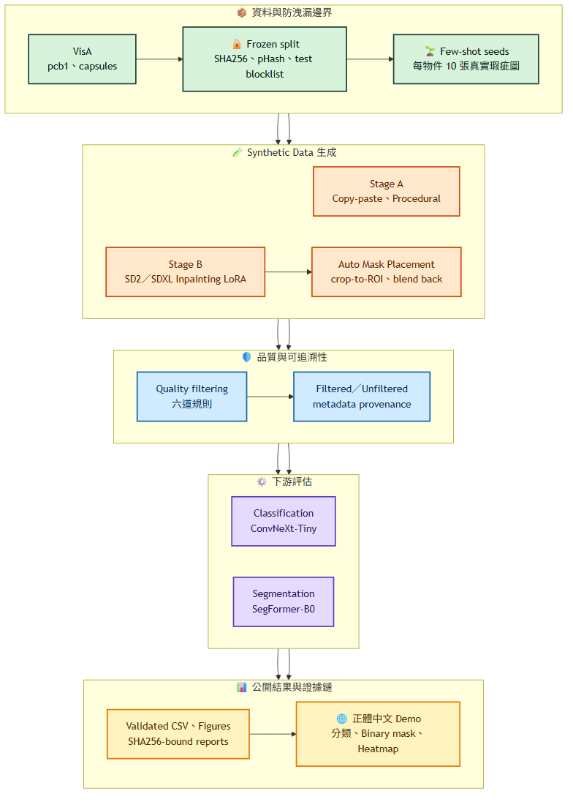

# DefectForge：VisA Synthetic Data 瑕疵生成與評估

[](LICENSE)
[](https://github.com/kuotunyu/defectforge-visa-synthetic-data/releases/latest)

> **狀態：v1.2.1 已完成並公開。**
> 下游結果表與最終結論皆由通過獨立驗證的 CSV 自動產生，不手動填寫數字。
> 驗證入口請見 `scripts/verify_readme.py` 與 `scripts/verify_publish.py`。

公開成果：
[Synthetic Dataset](https://huggingface.co/datasets/steven0226/defectforge-visa-synthetic) ·
[SD2／SDXL LoRA Weights](https://huggingface.co/steven0226/defectforge-visa-lora) ·
[正體中文互動 Demo](https://steven0226-defectforge-visa-demo.hf.space/) ·
[Release](https://github.com/kuotunyu/defectforge-visa-synthetic-data/releases)

在每個物件只有 **10 張真實瑕疵圖**的條件下，本專案以 Open Model、Open Data
重建 NVIDIA GTC 2026 Cosmos AnomalyGen 方法論。主實驗結果顯示：已篩選
Synthetic Data **沒有**優於 Real-only；本專案完整保留這個負面結果，並用 v2 pilot
檢驗 Sampling 是否造成退步。

---

## 研究問題

Synthetic Data 能否改善少樣本工業瑕疵的 Classification 與 Segmentation？

| 項目 | 設定 |
|---|---|
| Dataset | [VisA](https://registry.opendata.aws/visa/)（CC BY 4.0）：`pcb1`、`capsules` |
| 真實瑕疵預算 | 每個物件 10 張，seed=42 |
| 下游任務 | Defect Classification＋Defect-region Segmentation |
| Synthetic Data 標註 | 全自動；放置用 Mask 就是 Segmentation Ground Truth |

### 防止 Split 洩漏

VisA 官方 `2cls_fewshot` 與 `2cls_highshot` CSV 是同一批影像的兩種不同切分。
在開始撰寫訓練程式前，我們先量測兩者的交集：

```text
highshot TRAIN(anomaly) ∩ fewshot TEST(anomaly) = 40   （每個物件，test 共 80 張）
fewshot TRAIN ⊂ highshot TRAIN                          True
highshot TEST ⊂ fewshot TEST                            True
```

混用兩套 Split 會把**一半的 test 瑕疵放進 training**。因此所有實驗統一以
`2cls_highshot` 為 base partition，共用同一個 frozen test set；完整決策見
[ADR-007](docs/decisions.md#adr-007)。

## 方法與系統架構



[查看 Mermaid 原始碼](docs/diagrams/readme_01_flowchart_system_architecture.mmd)

流程包含 frozen split 與 test blocklist、Copy-paste／Procedural／Diffusion
生成、六道 Quality Filtering、ConvNeXt-Tiny Classification、SegFormer-B0
Segmentation，以及 SHA256-bound evidence。Open-source 元件對照與工程詮釋見
[方法論文件](docs/methodology.md)。

### Agent 工作流

課程的 Chapter 5 把 Cosmos AnomalyGen 管線拆成一組可被自然語言驅動的 skill
（`anomalygen`、`finetune`、`prep-testcase`、`sdg-inference`、`sdg-refine`、`eval`…）。
本專案以 Claude Code 的專案級 skill 復刻同一層結構，每個階段各一個、各自帶前置條件、
可判定成敗的驗證與 fail-closed 護欄。

其中兩個公開在本 Repository：

| Skill | 職責 |
|---|---|
| [`defectforge`](.claude/skills/defectforge/SKILL.md) | Orchestrator：脈絡恢復 → 階段路由 → 里程碑收尾；對應課程的 `anomalygen` |
| [`df-guard`](.claude/skills/df-guard/SKILL.md) | 防洩漏護欄：frozen manifest checksum、test blocklist 比對、資源與身分邊界，任一失敗即阻擋該階段 |

其餘 11 個階段 skill 與 owner-only 的工作記憶保留在本機。取捨理由見
[ADR-028](docs/decisions.md#adr-028)。

## 實驗設計

主實驗包含五組控制組；第 1–4 組使用完全相同的真實資料，Synthetic Data 僅能額外加入，
所有組別都在同一個 frozen test set 評估：

1. **Real-only**：10 張真實瑕疵圖
2. **+ Standard Augmentation**：排除一般 augmentation 就足以改善的可能
3. **+ 未篩選 Synthetic Data**
4. **+ 已篩選 Synthetic Data**：主比較組
5. **Full-real upper bound**：60 張真實瑕疵圖

Validation 與 test 僅使用真實資料。Generator、Filter 與 defect-type clusterer
不讀取 test image；split manifest 在第一張 Synthetic Image 產生前就凍結，
並公開 `splits/test_blocklist.json` 供外部檢查。完整 protocol 見
[實驗設計文件](docs/experiment_protocol.md)。

## 實驗結果

下列表格只能由 `scripts/verify_readme.py --write` 產生，而且必須先通過
Classification 與 Segmentation 的獨立 validator。所有 Figure 也從相同兩份 CSV
建立，輸入 SHA256 記錄於 `reports/phase2_figures_validation.json`。


### 瑕疵分類（Classification）

<!-- BEGIN VERIFIED CLASSIFICATION_MAIN -->
| 物件 | 訓練組別 | Macro-F1 | 瑕疵 F1 | AUROC | 正常樣本 FPR |
| --- | --- | --- | --- | --- | --- |
| pcb1 | Real-only（10 張） | 0.6826 | 0.4815 | 0.9086 | 0.2065 |
| pcb1 | + Standard Augmentation | 0.6826 | 0.4815 | 0.9157 | 0.2065 |
| pcb1 | + 未篩選 Synthetic Data | 0.4866 | 0.1858 | 0.5556 | 0.3134 |
| pcb1 | + 已篩選 Synthetic Data | 0.4270 | 0.0160 | 0.2229 | 0.2090 |
| pcb1 | Full-real（60 張） | 0.6826 | 0.4815 | 0.9294 | 0.2065 |
| capsules | Real-only（10 張） | 0.5728 | 0.2535 | 0.7934 | 0.0913 |
| capsules | + Standard Augmentation | 0.6031 | 0.3333 | 0.7656 | 0.1452 |
| capsules | + 未篩選 Synthetic Data | 0.3839 | 0.0331 | 0.3145 | 0.3278 |
| capsules | + 已篩選 Synthetic Data | 0.3712 | 0.0444 | 0.2844 | 0.3817 |
| capsules | Full-real（60 張） | 0.6748 | 0.4874 | 0.8583 | 0.2075 |
<!-- END VERIFIED CLASSIFICATION_MAIN -->


#### 預註冊 3-seed 複跑的 mean ± std

實驗協定要求 Real-only 與最佳 Filtered 組各複跑 3 個 seed。上表為 seed 42 的單次結果，
下表是同一批 run 的 seed 變異：

<!-- BEGIN VERIFIED CLASSIFICATION_SEED_VARIANCE -->
| 物件 | 訓練組別 | Seeds | Macro-F1（mean ± std） | AUROC（mean ± std） |
| --- | --- | --- | --- | --- |
| pcb1 | Real-only（10 張） | 3 | 0.6808 ± 0.0031 | 0.9265 ± 0.0231 |
| pcb1 | + 已篩選 Synthetic Data | 3 | 0.3175 ± 0.1066 | 0.1677 ± 0.0502 |
| capsules | Real-only（10 張） | 3 | 0.5471 ± 0.0268 | 0.8160 ± 0.0224 |
| capsules | + 已篩選 Synthetic Data | 3 | 0.3609 ± 0.0201 | 0.3243 ± 0.0426 |
<!-- END VERIFIED CLASSIFICATION_SEED_VARIANCE -->

已篩選 Synthetic 組的 seed 間標準差比 Real-only 大一個數量級以上。這個變異度本身就說明：
在這個資料規模下，單一 seed 的細部差異不足以支撐結論。其餘 Classification 組別只有
seed 42，因此不在表內。Segmentation 的 3-seed 複跑見下一節。

### 瑕疵區域分割（Segmentation）

<!-- BEGIN VERIFIED SEGMENTATION_MAIN -->
| 物件 | 訓練組別 | Dice | mIoU | Pixel AUROC | AUPRO |
| --- | --- | --- | --- | --- | --- |
| pcb1 | Real-only（10 張） | 0.3762 | 0.6156 | 0.9460 | 0.6028 |
| pcb1 | + Standard Augmentation | 0.3836 | 0.6185 | 0.9144 | 0.5740 |
| pcb1 | + 未篩選 Synthetic Data | 0.2490 | 0.5709 | 0.9324 | 0.6065 |
| pcb1 | + 已篩選 Synthetic Data | 0.0621 | 0.5156 | 0.9010 | 0.7471 |
| pcb1 | Full-real（60 張） | 0.6862 | 0.7610 | 0.9296 | 0.5999 |
| pcb1 | 僅 Procedural | 0.0316 | 0.5076 | 0.8551 | 0.5963 |
| pcb1 | 僅 Copy-paste | 0.0000 | 0.4997 | 0.9015 | 0.4386 |
| pcb1 | 僅 Diffusion | 0.0000 | 0.4997 | 0.8288 | 0.4556 |
| pcb1 | All-mixed（與已篩選 Synthetic Data 共用） | 0.0621 | 0.5156 | 0.9010 | 0.7471 |
| capsules | Real-only（10 張） | 0.5958 | 0.7119 | 0.9858 | 0.8488 |
| capsules | + Standard Augmentation | 0.0000 | 0.4996 | 0.8661 | 0.5591 |
| capsules | + 未篩選 Synthetic Data | 0.0000 | 0.4996 | 0.4919 | 0.1666 |
| capsules | + 已篩選 Synthetic Data | 0.4570 | 0.6477 | 0.9737 | 0.9137 |
| capsules | Full-real（60 張） | 0.6331 | 0.7312 | 0.9991 | 0.9591 |
| capsules | 僅 Procedural | 0.0000 | 0.4996 | 0.6127 | 0.3506 |
| capsules | 僅 Copy-paste | 0.6101 | 0.7191 | 0.9869 | 0.9440 |
| capsules | 僅 Diffusion | 0.0000 | 0.4996 | 0.5178 | 0.2556 |
| capsules | All-mixed（與已篩選 Synthetic Data 共用） | 0.4570 | 0.6477 | 0.9737 | 0.9137 |
<!-- END VERIFIED SEGMENTATION_MAIN -->


#### 預註冊 3-seed 複跑的 mean ± std

[ADR-032](docs/decisions.md#adr-032) 在**執行前**決定把**全部 8 個 formal group**都補到
3 個 seed（42／43／44），而不是只補其中兩組——這樣就沒有任何一組缺誤差棒，也不會出現
「看到結果才挑複跑對象」的疑慮。上表為 seed 42 錨點，下表是同一批組別的 seed 變異：

<!-- BEGIN VERIFIED SEGMENTATION_SEED_VARIANCE -->
| 物件 | 訓練組別 | Seeds | Dice（mean ± std） | AUPRO（mean ± std） |
| --- | --- | --- | --- | --- |
| pcb1 | Real-only（10 張） | 3 | 0.3300 ± 0.0489 | 0.5834 ± 0.0168 |
| pcb1 | + Standard Augmentation | 3 | 0.4103 ± 0.0789 | 0.6067 ± 0.0308 |
| pcb1 | + 未篩選 Synthetic Data | 3 | 0.0830 ± 0.1438 | 0.5783 ± 0.0508 |
| pcb1 | + 已篩選 Synthetic Data | 3 | 0.0438 ± 0.0381 | 0.6600 ± 0.0993 |
| pcb1 | Full-real（60 張） | 3 | 0.6754 ± 0.0193 | 0.7022 ± 0.1439 |
| pcb1 | 僅 Procedural | 3 | 0.1543 ± 0.1190 | 0.5790 ± 0.0462 |
| pcb1 | 僅 Copy-paste | 3 | 0.0000 ± 0.0000 | 0.4906 ± 0.0550 |
| pcb1 | 僅 Diffusion | 3 | 0.0000 ± 0.0000 | 0.4711 ± 0.0829 |
| pcb1 | All-mixed（與已篩選 Synthetic Data 共用） | 3 | 0.0438 ± 0.0381 | 0.6600 ± 0.0993 |
| capsules | Real-only（10 張） | 3 | 0.5253 ± 0.0693 | 0.7965 ± 0.0520 |
| capsules | + Standard Augmentation | 3 | 0.1404 ± 0.2432 | 0.6509 ± 0.1413 |
| capsules | + 未篩選 Synthetic Data | 3 | 0.0000 ± 0.0000 | 0.2405 ± 0.1169 |
| capsules | + 已篩選 Synthetic Data | 3 | 0.1523 ± 0.2639 | 0.4751 ± 0.3834 |
| capsules | Full-real（60 張） | 3 | 0.6722 ± 0.0389 | 0.9417 ± 0.0252 |
| capsules | 僅 Procedural | 3 | 0.0000 ± 0.0000 | 0.2685 ± 0.1015 |
| capsules | 僅 Copy-paste | 3 | 0.3895 ± 0.3383 | 0.9124 ± 0.0463 |
| capsules | 僅 Diffusion | 3 | 0.0000 ± 0.0000 | 0.2569 ± 0.0358 |
| capsules | All-mixed（與已篩選 Synthetic Data 共用） | 3 | 0.1523 ± 0.2639 | 0.4751 ± 0.3834 |
<!-- END VERIFIED SEGMENTATION_SEED_VARIANCE -->

#### 跨機器重現

複跑時 Drive 上沒有先前的 `runs/` 樹可跳過，於是 seed 42 在**另一台 Colab 機器、
另一個時間**被完整重跑了一次。這個意外是免費的重現性證據，因此加以驗證而非丟棄：

<!-- BEGIN VERIFIED SEGMENTATION_REPRODUCTION -->
- 重新執行 seed 42 的實跑 run：**16** 個（2 個物件 × 8 組）。
- `model.safetensors` SHA256 與已發佈值相同者：**16 / 16**。判定：**逐 bit 相同**。
- 四項指標的最大絕對差：dice `0.00000000`、miou `0.00000000`、pixel_auroc `0.00000000`、aupro `0.00000000`。
- 基準是複跑前已發佈的表格 `reports/segmentation_seed42_baseline.csv`；比對由 `scripts/verify_seed42_reproduction.py` 執行，逐 run 結果見[重現檢查報告](reports/seed42_reproduction.md)。
<!-- END VERIFIED SEGMENTATION_REPRODUCTION -->

比對的基準是複跑**之前**就已 commit 的表格，不是事後挑選的數字。

#### Dice 與 AUPRO 的方向不一致

Dice 依賴固定 threshold 0.5，AUPRO 不依賴 threshold。在 seed 42 上，兩者對同一批 run
給出相反的方向：

<!-- BEGIN VERIFIED SEGMENTATION_THRESHOLD -->
| 物件 | 訓練組別 | Dice（threshold 0.5） | AUPRO（不依賴 threshold） | Dice Δ vs Real-only | AUPRO Δ vs Real-only |
| --- | --- | --- | --- | --- | --- |
| pcb1 | Real-only（10 張） | 0.3762 | 0.6028 | — | — |
| pcb1 | + Standard Augmentation | 0.3836 | 0.5740 | +0.0074 | -0.0288 |
| pcb1 | + 未篩選 Synthetic Data | 0.2490 | 0.6065 | -0.1272 | +0.0037 |
| pcb1 | + 已篩選 Synthetic Data | 0.0621 | 0.7471 | -0.3140 | +0.1443 |
| pcb1 | Full-real（60 張） | 0.6862 | 0.5999 | +0.3100 | -0.0029 |
| capsules | Real-only（10 張） | 0.5958 | 0.8488 | — | — |
| capsules | + Standard Augmentation | 0.0000 | 0.5591 | -0.5958 | -0.2897 |
| capsules | + 未篩選 Synthetic Data | 0.0000 | 0.1666 | -0.5958 | -0.6821 |
| capsules | + 已篩選 Synthetic Data | 0.4570 | 0.9137 | -0.1387 | +0.0649 |
| capsules | Full-real（60 張） | 0.6331 | 0.9591 | +0.0373 | +0.1103 |
<!-- END VERIFIED SEGMENTATION_THRESHOLD -->

##### 複跑後的判定：AUPRO 的提升沒有重現

複跑改變了這個結論的一半。ADR-032 的兩條規則在執行前就寫死，判定結果如下：

<!-- BEGIN VERIFIED SEGMENTATION_REPLICATION -->
| 物件 | Dice／AUPRO 符號相反的 seed | Dice Δ（mean ± std） | AUPRO Δ（mean ± std） | 達預註冊門檻 |
| --- | --- | --- | --- | --- |
| pcb1 | 42, 44 | -0.2862 ± 0.0250 | +0.0766 ± 0.0878 | 是 |
| capsules | 42 | -0.3730 ± 0.2055 | -0.3215 ± 0.3357 | 否 |

- 規則 1（方向矛盾）判定：**真實現象**。門檻是「至少一個物件上、3 個 seed 中 ≥2 個符號相反」，達標物件：pcb1。
- 規則 2（`capsules/std_aug` 崩潰）判定：**系統性**。Dice 為零的 seed：42、44。因此 ADR-031 的主張維持不變。
- 兩條規則都在 [ADR-032](docs/decisions.md#adr-032) 於**複跑執行前**寫死，看到結果後未作任何修改。
<!-- END VERIFIED SEGMENTATION_REPLICATION -->

必須明講的是：**seed 42 上「AUPRO 顯示合成資料有幫助」這件事沒有通過複跑。**
`capsules` 在 seed 43 與 44 上 Dice 與 AUPRO **同時**大幅退步，只有 seed 42 出現
AUPRO 上升；因此在兩物件 macro 層級，兩個指標的 3-seed 平均其實**方向一致、都是負的**
（確切數值見下方「限制與誠實揭露」的 verified 區塊）。預註冊規則判定為真實的方向矛盾
只存在於 `pcb1` 這一個物件上。

換句話說，補了 seed 之後，負面結論**變得更強**而不是更弱。完整判定過程見
[分割複跑判定報告](reports/segmentation_replication.md)。

零 Dice 本身的原因不是模型失效，而是**機率天花板**。重跑 seed 42 全部 16 個 run 的推論後
量測到：所有零 Dice 的 run，其在整個 test set 上的最高預測機率都低於 threshold 0.5，
因此不可能存在任何正像素——空 Mask 是**算術上必然**。這些 run 的 pixel AUROC 分布很廣，
代表 Dice 是否退化與模型的排序能力無關。逐 run 量測值見
[零 Dice 診斷報告](reports/zero_dice_diagnosis.md)，由
`scripts/diagnose_zero_dice_segmentation.py` 產生；該腳本會**先重算已發佈指標並要求相符**，
才輸出診斷。

**這份診斷只涵蓋 seed 42 的 16 個 run。** 複跑後零 Dice 的 run 總數增加（見下方 verified
區塊），seed 43／44 的零 Dice run **尚未**做同樣的機率天花板量測，因此上述機制在那些 run
上是**尚未驗證的推論**，不是已量測的事實。

本專案**不因此改換主指標，也不調校 threshold**：在 test 上挑一個讓 Dice 好看的 threshold
等同於用 test 做模型選擇。預註冊的主結論仍以 Dice 與 Macro-F1 為準，AUPRO、threshold
敏感度與上述診斷一律**併列揭露**。決策見 [ADR-027](docs/decisions.md#adr-027) 與
[ADR-030](docs/decisions.md#adr-030)。

## v2 後續實驗：退步是否來自 Sampling？

在完全不讀取 test set 的前提下，v2 pilot 檢驗 Label balancing 是否讓
Synthetic Anomaly 過度占據 positive-class exposure：

| Validation candidate | pcb1 Macro-F1 | pcb1 AUROC | capsules Macro-F1 | capsules AUROC |
|---|---:|---:|---:|---:|
| Real-only | 0.6944 | 0.9167 | 0.8133 | 0.9120 |
| v1 Class-balanced Mixing | 0.5537 | 0.3139 | 0.4545 | 0.2083 |
| Domain-balanced 50% real bad | 0.6944 | **0.9389** | 0.6571 | 0.7500 |
| Domain-balanced 75% real bad | 0.6944 | 0.8806 | 0.6571 | **0.8611** |

Domain balancing 救回 pcb1 與部分 capsules，但預先註冊的跨物件 gate 仍未通過，
因此在 test evaluation 與 three-seed confirmatory run 前停止。這是
**exploratory validation result**，不取代 v1 結果；詳見
[v2 Pilot Report](reports/v2_pilot_report.md)。

## 公開互動 Demo


[開啟正體中文 DefectForge Demo](https://steven0226-defectforge-visa-demo.hf.space/)

Demo 使用 CPU Basic，會驗證 checkpoint SHA256、不保存上傳影像，並提供五張 VisA
範例；輸出包含 Classification Confidence、Binary Mask、Probability Heatmap 與
checkpoint provenance。受 SegFormer upstream License 限制，僅供
non-commercial research／evaluation。

## 限制與誠實揭露

<!-- BEGIN VERIFIED RESULT_OUTCOME -->
- Classification：已篩選 Synthetic Data 相對 Real-only 的平均 Macro-F1 差異為 `-0.2286`。
- Segmentation：已篩選 Synthetic Data 相對 Real-only 的平均 Dice 差異為 `-0.2264`（seed 42 錨點）。
- Classification 負面結果：**是——已篩選 Synthetic Data 未提升平均 Macro-F1。**
- Segmentation 負面結果：**是——已篩選 Synthetic Data 未提升平均 Dice。**
- Segmentation（threshold-free）：seed 42 的平均 AUPRO 差異為 `+0.1046`，與 Dice **方向相反**。
- **複跑後這個 AUPRO 提升沒有重現。**3 個 seed（42, 43, 44）的兩物件平均：Dice `-0.3296 ± 0.0903`、AUPRO `-0.1224 ± 0.1976`，兩者方向一致。seed 42 單獨呈現的 AUPRO 正向差異是該 seed 的特例。
- 依 ADR-032 **執行前寫死**的規則判定：Dice／AUPRO 方向矛盾為**真實現象**（達標物件：pcb1）；`capsules/std_aug` 的 Dice 崩潰為**系統性**。
- 48 個實跑的 Segmentation run 中有 23 個在固定 threshold 0.5 下 Dice = 0（整張預測為背景），其中 12 個的 pixel AUROC 仍達 0.80 以上（最高 `0.9066`）。
- 主結論仍以預註冊的 Macro-F1 與 Dice 為準；AUPRO 與 threshold 敏感度是**併列揭露**，不是事後換指標。
<!-- END VERIFIED RESULT_OUTCOME -->

- Segmentation 的 8 個 formal group 已全部補到 3 個 seed（[ADR-032](docs/decisions.md#adr-032)）。
  **Classification 仍只有 Real-only 與已篩選 Synthetic 兩組達到 3 seed**，其餘組別只有
  seed 42，因此 Classification 的組間細部排序仍不應被過度解讀。
- 3 個 seed 對 10 張瑕疵影像而言仍是很小的樣本。標準差在 `capsules` 上相當大
  （見上方 mean ± std 表），所以本專案只主張方向，不主張精確幅度。
- **零 Dice 的機率天花板診斷只做在 seed 42 的 16 個 run 上。** seed 43／44 新增的零 Dice
  run 沒有重跑推論，因此不宣稱同一機制已在那些 run 上獲得驗證。
- 合成組的正樣本曝光高度偏向 Synthetic Data：`results/classification.csv` 的
  `sampled_real_bad` / `sampled_synthetic_bad` 顯示，加入 500 張合成瑕疵後，
  真實瑕疵在同一份 sampling schedule 中的曝光量遠低於 Real-only。
  這是 v2 pilot 檢驗的假說，也代表 v1 的負面結果**同時**受合成品質與 sampling 設計影響，
  不能單獨歸因於「合成資料無效」。
- 僅研究 `pcb1` 與 `capsules`，不能直接推廣到其他工業物件。
- Synthetic Data 的視覺品質不等於下游任務有效性。
- 預註冊 threshold 0.5 下，四張決定性 Demo frame 的 Binary Mask coverage 都是 0。
- 公開 Demo 是 research／evaluation tool，不是 production AOI、品質放行或安全系統。
- v2 pilot 是 exploratory validation；未通過 gate，因此沒有執行 confirmatory test。

## 重現方式

開發與驗證環境為 Windows 11、Python 3.12、RTX 4090；資料路徑統一由
`configs/paths.yaml` 管理。

```powershell
git clone https://github.com/kuotunyu/defectforge-visa-synthetic-data.git
Set-Location defectforge-visa-synthetic-data
uv sync --frozen --python 3.12

uv run python scripts/download_visa.py
uv run python scripts/prepare_splits.py
uv run python scripts/verify_splits.py

uv run ruff check .
uv run pytest -q
uv run python scripts/verify_publish.py
```

Configuration／CLI 契約見 [Interfaces](docs/interfaces.md)，預先註冊的下游設計見
[Experiment Protocol](docs/experiment_protocol.md)，Colab 薄封裝位於
[`notebooks/`](notebooks/)。

## Repository 結構

| 路徑 | 內容 |
|---|---|
| `src/` | Data／Synthetic／Filtering／Training／Evaluation／Inference Source Code |
| `configs/`、`splits/` | 可重現設定、Frozen Manifest 與 Test Blocklist |
| `scripts/`、`tests/` | 執行入口、獨立 Validator 與測試 |
| `docs/` | 方法論、Experiment Protocol、CLI 契約與 ADR |
| `reports/`、`results/` | SHA256-bound Evidence、Figure 與凍結結果 |
| `notebooks/` | Colab Notebook |
| `.claude/skills/` | 公開的兩個 Agent Skill：Orchestrator 與防洩漏 Guard |

## 授權與引用

本 Repository 的 Source Code 採 **MIT License**（見 [LICENSE](LICENSE)）。
MIT 僅涵蓋程式碼；Dataset、Synthetic Images 與 Model Weights 各自保留原始條款。
可直接引用的 Metadata 見 [CITATION.cff](CITATION.cff)，第三方資產總表見
[THIRD_PARTY_NOTICES.md](THIRD_PARTY_NOTICES.md)：

<!-- BEGIN VERIFIED LICENSE_CHAIN -->
| 資產 | License | DefectForge 義務 |
|---|---|---|
| VisA 原始 Dataset | CC BY 4.0 | 標示 VisA 與其論文；Hugging Face Dataset 不得包含原始影像 |
| `sd2-community/stable-diffusion-2-inpainting` | CreativeML Open RAIL++-M | 保留用途限制，並揭露 preservation mirror |
| `diffusers/stable-diffusion-xl-1.0-inpainting-0.1` | CreativeML Open RAIL++-M | 保留用途限制 |
| `facebook/dinov2-base` | Apache-2.0 | 標示模型與 DINOv2 論文 |
| DefectForge Synthetic Images | CC BY 4.0 | 視為 VisA 衍生內容；保留 VisA attribution，並揭露 Diffusion base model License |
| DefectForge LoRA Weights | CreativeML Open RAIL++-M | 繼承對應 base model 的限制，並附上 License 連結 |
| DefectForge Source Code | MIT | MIT 僅授權程式碼，不包含 Dataset 與 Model Weights |
<!-- END VERIFIED LICENSE_CHAIN -->

如需引用 DefectForge，可在 GitHub 右側 **Cite this repository** 取得 Metadata；
若使用 VisA 或衍生 Synthetic Data，仍須引用 VisA 原始論文。完整論文與上游授權
見 [方法論](docs/methodology.md)與 [License Chain](docs/license_chain.md)。
