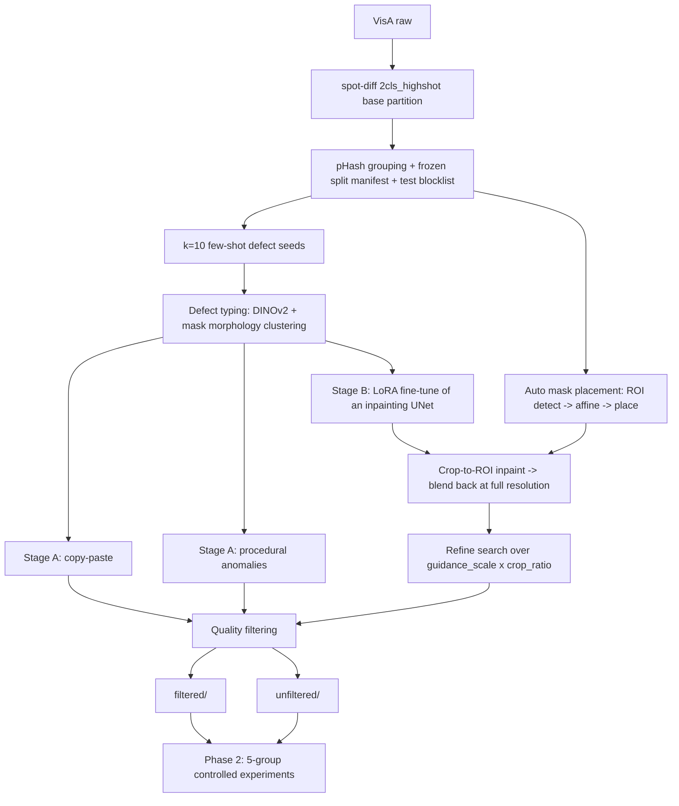
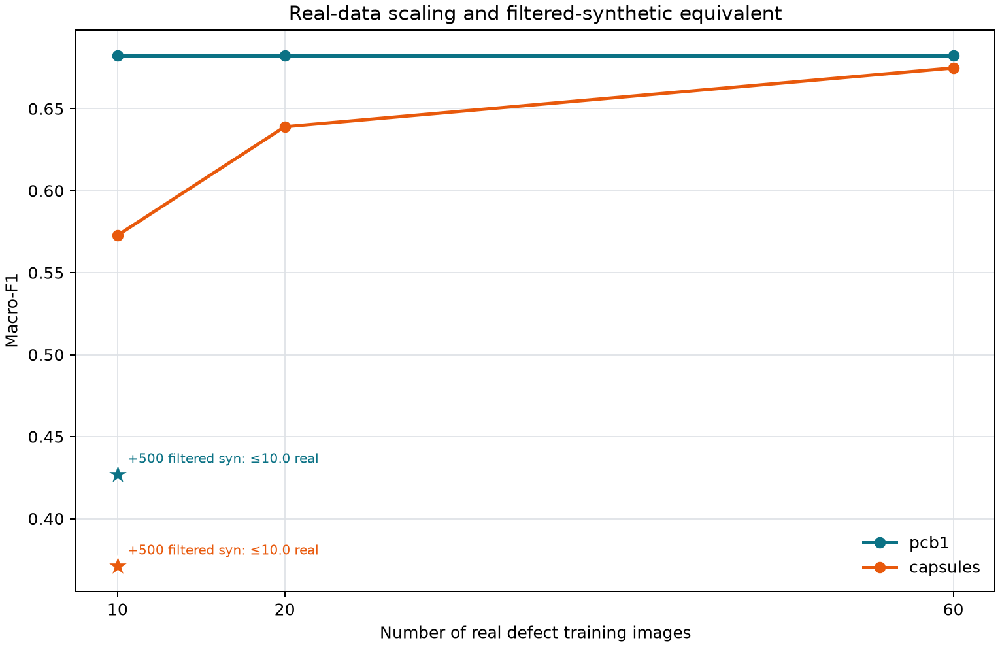
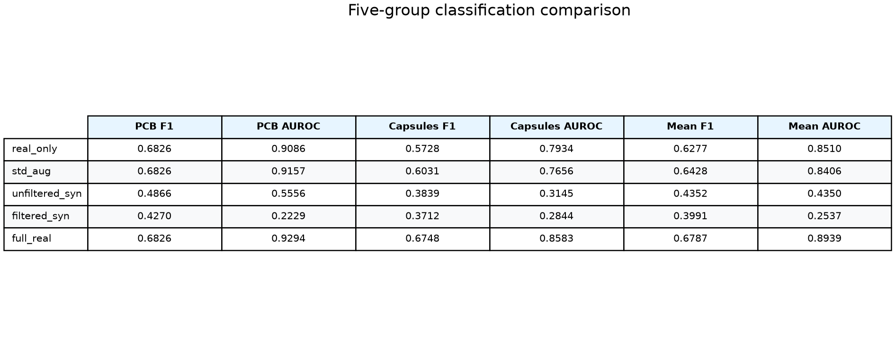
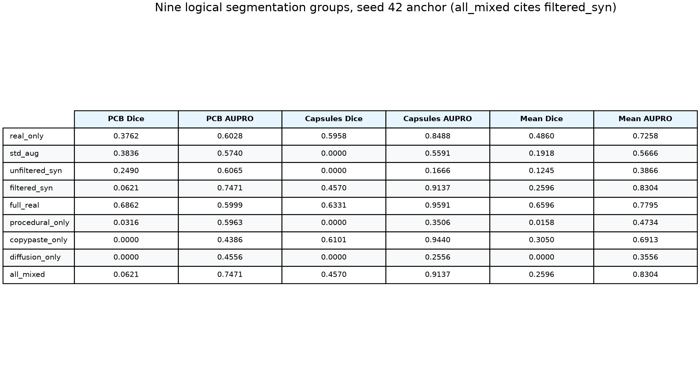
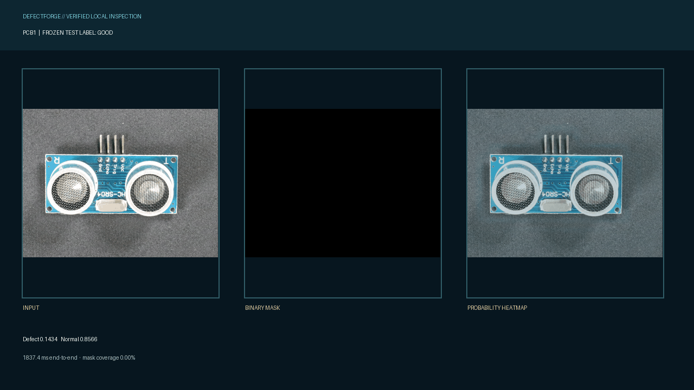

# DefectForge-VisA

[](https://github.com/kuotunyu/01-defectforge-visa/actions/workflows/verify.yml)

> **Status: Published; M0–M35 verified.**
> Both downstream result tables and the outcome statement are generated atomically from
> independently validated CSVs. Numbers are never typed by hand — see `scripts/verify_readme.py`.

Published artifacts:
[synthetic dataset](https://huggingface.co/datasets/steven0226/defectforge-visa-synthetic) ·
[SD2/SDXL LoRA weights](https://huggingface.co/steven0226/defectforge-visa-lora) ·
[public inspection demo](https://huggingface.co/spaces/steven0226/defectforge-visa-demo)

**Can synthetic defect images improve few-shot industrial anomaly classification and
segmentation?** An open-source replication of the NVIDIA GTC 2026 course
*Few-shot Industrial Synthetic Data Generation with the NVIDIA Defect Image Generation Agent*
(Cosmos AnomalyGen), rebuilt entirely with open models and open data.

**繁中摘要**：在「每個物件只有 10 張真實瑕疵圖」的少樣本情境下，用兩階段合成資料
（程序化／copy-paste ＋ diffusion inpainting LoRA）證明合成資料能否提升瑕疵分類與瑕疵區域分割。
方法論復刻 NVIDIA GTC 2026 的 Cosmos AnomalyGen 課程，但全部改用開源工具實作。
若合成資料**沒有**帶來提升，我們會如實報告並分析原因。

---

## Problem

Real production lines rarely have enough defect images to train a reliable AOI model.
On VisA, each object ships only **100 anomalous images**, and the official few-shot
protocol trims that to **10**. Meanwhile normal images are essentially free.
This is exactly the asymmetry synthetic data should be able to close.

| | |
|---|---|
| Dataset | [VisA](https://registry.opendata.aws/visa/) (CC BY 4.0) — `pcb1`, `capsules` |
| Real defect budget | 10 images per object (seed=42) |
| Downstream tasks | defect classification + defect-region segmentation |
| Labels for synthetic data | **fully automatic** — the placed mask *is* the segmentation ground truth |

### The split matters, and it is easy to get wrong

VisA's official `2cls_fewshot` and `2cls_highshot` CSVs are two different partitions of the
same images. We measured their overlap before writing any code:

```
highshot TRAIN(anomaly) ∩ fewshot TEST(anomaly) = 40   (per object, out of 80)
fewshot TRAIN ⊂ highshot TRAIN                          True
highshot TEST ⊂ fewshot TEST                            True
```

Training a "full-real upper bound" on the highshot train split and scoring it on the fewshot
test split would put **half the test defects into training**. We therefore use
`2cls_highshot` as the single base partition, giving one frozen test set shared by every
group. Because the partitions nest, this also hands us a free real-data scaling curve at
**10 → 20 → 60** real defect images — which is what lets us answer *how many real defect
images our synthetic data is worth*. Details: [ADR-007](docs/decisions.md#adr-007).

## Method



The mapping from each Cosmos AnomalyGen component to its open-source stand-in is
documented cell-by-cell in [docs/methodology.md](docs/methodology.md), including which
parts are our own interpretation rather than published NVIDIA formulas.

## Experiments

Five groups, identical real data in groups 1–4, synthetic strictly additive, all scored on
the same frozen test set:

1. Real-only (10 real defects)
2. + Standard Augmentation — rules out "plain augmentation would have done it"
3. + Unfiltered Synthetic
4. + Filtered Synthetic — main result, and the case for the filtering pipeline
5. Full-real upper bound (60 real defects)

Plus: a real-data scaling curve (10 / 20 / 60), a synthetic-volume sweep at
{125, 250, 500} mirroring the course's own curve, a base-model ablation (SD2 vs SDXL),
and a segmentation group trained with **zero real defect pixels**.

Anti-leakage: validation and test are real-only; the generator, the filter and the
defect-type clusterer never read a test image. The split manifest (seed, SHA256,
pHash groups) is frozen before a single synthetic image is generated, and
`splits/test_blocklist.json` is published so anyone can check us.
Full protocol: [docs/experiment_protocol.md](docs/experiment_protocol.md).

## Results

The tables below are populated only by `scripts/verify_readme.py --write` after the
formal classification and segmentation artefacts pass their independent validators.
The figures are built from the same two CSVs and carry their input hashes in
`reports/phase2_figures_validation.json`.



### Classification

<!-- BEGIN VERIFIED CLASSIFICATION_MAIN -->
| Object | Training group | Macro-F1 | Defect F1 | AUROC | Normal FPR |
| --- | --- | --- | --- | --- | --- |
| pcb1 | Real-only (10) | 0.6826 | 0.4815 | 0.9086 | 0.2065 |
| pcb1 | + Standard Augmentation | 0.6826 | 0.4815 | 0.9157 | 0.2065 |
| pcb1 | + Unfiltered Synthetic | 0.4866 | 0.1858 | 0.5556 | 0.3134 |
| pcb1 | + Filtered Synthetic | 0.4270 | 0.0160 | 0.2229 | 0.2090 |
| pcb1 | Full-real (60) | 0.6826 | 0.4815 | 0.9294 | 0.2065 |
| capsules | Real-only (10) | 0.5728 | 0.2535 | 0.7934 | 0.0913 |
| capsules | + Standard Augmentation | 0.6031 | 0.3333 | 0.7656 | 0.1452 |
| capsules | + Unfiltered Synthetic | 0.3839 | 0.0331 | 0.3145 | 0.3278 |
| capsules | + Filtered Synthetic | 0.3712 | 0.0444 | 0.2844 | 0.3817 |
| capsules | Full-real (60) | 0.6748 | 0.4874 | 0.8583 | 0.2075 |
<!-- END VERIFIED CLASSIFICATION_MAIN -->



### Segmentation

<!-- BEGIN VERIFIED SEGMENTATION_MAIN -->
| Object | Training group | Dice | mIoU | Pixel AUROC | AUPRO |
| --- | --- | --- | --- | --- | --- |
| pcb1 | Real-only (10) | 0.3762 | 0.6156 | 0.9460 | 0.6028 |
| pcb1 | + Standard Augmentation | 0.3836 | 0.6185 | 0.9144 | 0.5740 |
| pcb1 | + Unfiltered Synthetic | 0.2490 | 0.5709 | 0.9324 | 0.6065 |
| pcb1 | + Filtered Synthetic | 0.0621 | 0.5156 | 0.9010 | 0.7471 |
| pcb1 | Full-real (60) | 0.6862 | 0.7610 | 0.9296 | 0.5999 |
| pcb1 | Procedural-only | 0.0316 | 0.5076 | 0.8551 | 0.5963 |
| pcb1 | Copy-paste-only | 0.0000 | 0.4997 | 0.9015 | 0.4386 |
| pcb1 | Diffusion-only | 0.0000 | 0.4997 | 0.8288 | 0.4556 |
| pcb1 | All-mixed (alias of Filtered Synthetic) | 0.0621 | 0.5156 | 0.9010 | 0.7471 |
| capsules | Real-only (10) | 0.5958 | 0.7119 | 0.9858 | 0.8488 |
| capsules | + Standard Augmentation | 0.0000 | 0.4996 | 0.8661 | 0.5591 |
| capsules | + Unfiltered Synthetic | 0.0000 | 0.4996 | 0.4919 | 0.1666 |
| capsules | + Filtered Synthetic | 0.4570 | 0.6477 | 0.9737 | 0.9137 |
| capsules | Full-real (60) | 0.6331 | 0.7312 | 0.9991 | 0.9591 |
| capsules | Procedural-only | 0.0000 | 0.4996 | 0.6127 | 0.3506 |
| capsules | Copy-paste-only | 0.6101 | 0.7191 | 0.9869 | 0.9440 |
| capsules | Diffusion-only | 0.0000 | 0.4996 | 0.5178 | 0.2556 |
| capsules | All-mixed (alias of Filtered Synthetic) | 0.4570 | 0.6477 | 0.9737 | 0.9137 |
<!-- END VERIFIED SEGMENTATION_MAIN -->



## v2 follow-up: did sampling cause the failure?

After v1.0.0 was frozen, we tested one explicit failure hypothesis without touching the
test set: label balancing gave the 500 synthetic anomalies almost all positive-class
exposure, leaving the 10 real anomalies only 14 of 1,600 sampled positions.

| Validation candidate | pcb1 Macro-F1 | pcb1 AUROC | capsules Macro-F1 | capsules AUROC |
|---|---:|---:|---:|---:|
| Real-only | 0.6944 | 0.9167 | 0.8133 | 0.9120 |
| v1 class-balanced mixing | 0.5537 | 0.3139 | 0.4545 | 0.2083 |
| Domain-balanced 50% real bad | 0.6944 | **0.9389** | 0.6571 | 0.7500 |
| Domain-balanced 75% real bad | 0.6944 | 0.8806 | 0.6571 | **0.8611** |

Domain balancing rescued pcb1 and much of capsules, confirming that exposure collapse
was real. It still failed the preregistered cross-object gate: the selected 75% candidate
was `-0.0781` mean Macro-F1 versus real-only and capsules remained `-0.1562`. Therefore
we stopped before test evaluation or a three-seed confirmatory run. This is an
**exploratory validation result**, not a replacement for the v1 tables above.
[Protocol and full report](reports/v2_pilot_report.md).

## Local demo



Try the same formal models in the
[public DefectForge Inspection Console](https://huggingface.co/spaces/steven0226/defectforge-visa-demo).
The Space starts on CPU Basic, checks all four checkpoint hashes before loading, does not
save uploads, and includes five attributed VisA examples that can be selected without
supplying a local image. It is restricted to non-commercial research/evaluation because
of the SegFormer upstream license.

The GIF is generated by `scripts/record_demo_artifacts.py` from four deterministic
images in the frozen highshot test partition. It uses the post-evaluation best formal
classifier and segmenter checkpoints for each object, verifies those checkpoints against
their raw reports, and does not change any reported metric.

## Limitations

The outcome block is deliberately generated under Limitations so a flat or negative
synthetic-data result cannot be silently omitted from the final narrative.

At the preregistered segmentation threshold of 0.5, all four deterministic demo frames
produced zero binary-mask coverage. The probability heatmaps and classifier probabilities
are preserved in the GIF, and the samples were not reselected to hide this limitation.

<!-- BEGIN VERIFIED RESULT_OUTCOME -->
- Classification, Filtered Synthetic vs Real-only: `-0.2286` mean Macro-F1.
- Segmentation, Filtered Synthetic vs Real-only: `-0.2264` mean Dice.
- Classification negative result: **yes — Filtered Synthetic did not improve mean Macro-F1.**
- Segmentation negative result: **yes — Filtered Synthetic did not improve mean Dice.**
<!-- END VERIFIED RESULT_OUTCOME -->

## Reproduce

DefectForge is developed and fully tested on native Windows 11 with Python 3.12 and an
RTX 4090. The data root is configured once in `configs/paths.yaml`; code never embeds a
machine-specific user path.

```powershell
git clone https://github.com/kuotunyu/01-defectforge-visa.git
Set-Location 01-defectforge-visa
uv sync --frozen --python 3.12

# Confirm the locked CUDA environment.
uv run python -c "import torch; print(torch.__version__, torch.cuda.is_available(), torch.cuda.get_device_name(0))"

# Download/check VisA, prepare both official layouts, and independently recheck ADR-007.
uv run python scripts/download_visa.py
uv run python scripts/prepare_splits.py
uv run python scripts/verify_splits.py

# Fast repository verification. Training commands remain dry-run here.
uv run ruff check .
uv run pytest -q
uv run python scripts/run_classifier_matrix.py --dry-run
uv run python scripts/package_m18_colab.py --dry-run
```

The full ordered pipeline, immutable checkpoints, expected sample counts, and validator
for every milestone are in [PLAN.md](PLAN.md). Configuration and CLI contracts are in
[docs/interfaces.md](docs/interfaces.md); the preregistered downstream protocol is in
[docs/experiment_protocol.md](docs/experiment_protocol.md).

GPU work is deliberately split:

- SD2 generation, SDXL inference, classification, and one-step SegFormer smoke tests run
  locally.
- SDXL LoRA training uses `notebooks/01_train_inpaint_lora_sdxl.ipynb`.
- The 16 physical SegFormer runs use `notebooks/02_train_segformer.ipynb`; `all_mixed`
  cites `filtered_syn` and is not rerun.

Both notebooks are thin wrappers around the same tracked Python trainers. They download
no test data outside the frozen manifest, save resumable checkpoints, and return raw
reports that are independently aggregated. See [instructions_for_me.md](instructions_for_me.md)
for the exact Colab handoff.

## Repository map

| Path | What it holds |
|---|---|
| [CLAUDE.md](CLAUDE.md) | Working rules for this repo |
| [PLAN.md](PLAN.md) | Phase 1 milestones with per-item verification |
| [docs/](docs/) | Methodology, protocols, specs, ADRs, worklog |
| `src/` | Pipeline code (data / synthetic / filtering / training / evaluation / inference) |
| `splits/` | Frozen split manifest, checksums, defect taxonomy |
| `notebooks/` | Colab notebooks (LoRA training) |
| `reports/` | Generated reports and figures |
| `.claude/skills/` | Project-level agent skills mirroring the course's agentic flow |

## License & Citations

Source code in this repository: **MIT** (see [LICENSE](LICENSE)). The MIT grant covers
code only — data and model weights carry their own terms:

<!-- BEGIN VERIFIED LICENSE_CHAIN -->
| Asset | License | DefectForge obligation |
|---|---|---|
| VisA source dataset | CC BY 4.0 | Attribute VisA and its paper; do not include the original images in our HF dataset |
| `sd2-community/stable-diffusion-2-inpainting` | CreativeML Open RAIL++-M | Preserve the use-based restrictions and disclose the preservation mirror |
| `diffusers/stable-diffusion-xl-1.0-inpainting-0.1` | CreativeML Open RAIL++-M | Preserve the use-based restrictions |
| `facebook/dinov2-base` | Apache-2.0 | Attribute the model and DINOv2 paper |
| DefectForge synthetic images | CC BY 4.0 | Treat as VisA derivatives; retain VisA attribution and disclose diffusion base licenses |
| DefectForge LoRA weights | CreativeML Open RAIL++-M | Inherit the corresponding base-model restrictions and link the license |
| DefectForge source code | MIT | The MIT grant applies to code only, not data or model weights |
<!-- END VERIFIED LICENSE_CHAIN -->

References:

- Zou et al., *SPot-the-Difference Self-Supervised Pre-training for Anomaly Detection
  and Segmentation* (ECCV 2022) — the VisA dataset and its official splits.
  [arXiv:2207.14315](https://arxiv.org/abs/2207.14315) ·
  [amazon-science/spot-diff](https://github.com/amazon-science/spot-diff)
- Hu et al., *AnomalyDiffusion: Few-Shot Anomaly Image Generation with Diffusion Model*
  (AAAI 2024) — the spatial-anomaly-embedding idea this pipeline mirrors.
  [arXiv:2312.05767](https://arxiv.org/abs/2312.05767)
- Zavrtanik et al., *DRAEM* (ICCV 2021) — procedural anomaly synthesis.
- Ghiasi et al., *Simple Copy-Paste is a Strong Data Augmentation Method* (CVPR 2021).
- NVIDIA GTC Taiwan 2026, *Few-shot Industrial Synthetic Data Gen with NVIDIA Defect
  Image Generation Agent* — methodological inspiration. This repository is an
  independent open-source replication and is **not** affiliated with or endorsed by NVIDIA.
