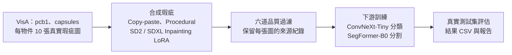

# DefectForge：VisA Synthetic Data 瑕疵生成與評估

[](LICENSE)
[](https://github.com/kuotunyu/defectforge-visa-synthetic-data/releases/latest)
狀態：v1.3.0 已發佈

產線剛導入新產品時，手上往往只有十來張真實瑕疵照片。本專案在公開資料集 VisA 上做對照實驗，檢驗「用生成模型多造一些瑕疵圖」能不能讓瑕疵檢測模型變好——在每個物件只有 **10 張真實瑕疵圖**的規模下，答案是**不能**。

> **TL;DR** — A controlled test of whether generated defects (copy-paste, procedural, SD2 / SDXL inpainting LoRA, then a 6-stage quality filter) help few-shot industrial inspection on VisA. With 10 real defect images per object they did not: across 3 seeds, adding filtered synthetic data lowered both classification Macro-F1 and segmentation Dice compared with real-only training.


*圖：橫軸是真實瑕疵訓練圖的數量，縱軸是分類 Macro-F1（seed 42）。星號是「10 張真實圖 + 500 張已篩選合成圖」，兩個物件都落在只用 10 張真實圖的結果之下。*

## 主要發現

**合成資料沒有帶來改善。** 分類結果（ConvNeXt-Tiny，3 個 seed；測試集全為真實影像：pcb1 正常 402／瑕疵 40 張，capsules 正常 241／瑕疵 40 張）：

<!-- BEGIN VERIFIED CLASSIFICATION_SEED_VARIANCE -->
| 物件 | 訓練組別 | Seeds | Macro-F1（mean ± std） | AUROC（mean ± std） |
| --- | --- | --- | --- | --- |
| pcb1 | Real-only（10 張） | 3 | 0.6808 ± 0.0031 | 0.9265 ± 0.0231 |
| pcb1 | + 已篩選 Synthetic Data | 3 | 0.3175 ± 0.1066 | 0.1677 ± 0.0502 |
| capsules | Real-only（10 張） | 3 | 0.5471 ± 0.0268 | 0.8160 ± 0.0224 |
| capsules | + 已篩選 Synthetic Data | 3 | 0.3609 ± 0.0201 | 0.3243 ± 0.0426 |
<!-- END VERIFIED CLASSIFICATION_SEED_VARIANCE -->

AUROC 低於 0.5 的原因見[限制與誠實揭露](#限制與誠實揭露)。

- **分割也沒有改善**（SegFormer-B0，3 個 seed 的 Dice）：pcb1 由 `0.3300 ± 0.0489` 降到 `0.0438 ± 0.0381`，capsules 由 `0.5253 ± 0.0693` 降到 `0.1523 ± 0.2639`。
- **追查過原因**：針對曝光失衡、瑕疵外觀、放置面積三個假說做了四次檢驗，每次都先把判定規則 commit 進 Git 再執行；四次都沒有通過門檻，過程中從未讀取測試集。
- **結果可逐 bit 重現**：在另一台機器重跑 seed 42 的 16 個分割 run，`model.safetensors` 的 SHA256 有 16 / 16 與已發佈值相同。
- **開工前先抓到資料洩漏**：VisA 兩套官方切分若混用，每個物件 80 張測試瑕疵圖中有 40 張會同時出現在訓練集（[ADR-007](docs/decisions.md#adr-007)）。

**公開成果**：[合成資料集（Hugging Face）](https://huggingface.co/datasets/steven0226/defectforge-visa-synthetic) ·
[SD2 / SDXL LoRA 權重](https://huggingface.co/steven0226/defectforge-visa-lora) ·
[線上 Demo（正體中文）](https://steven0226-defectforge-visa-demo.hf.space/) ·
[Release](https://github.com/kuotunyu/defectforge-visa-synthetic-data/releases)

**快速開始**：驗證本頁數字與跑測試的指令見[重現方式](#重現方式)。

---

## 研究問題

在少樣本工業瑕疵情境下，Synthetic Data 能否改善瑕疵分類（Classification）與瑕疵區域分割（Segmentation）？方法參考 NVIDIA GTC 2026 Cosmos AnomalyGen 的工業瑕疵合成與下游評估流程，改用 Open Model 與 Open Data 重做（詳見[方法論文件](docs/methodology.md)）。

| 評測項目 | 實驗設定 |
|---|---|
| **資料集** | [VisA](https://registry.opendata.aws/visa/)（CC BY 4.0）：`pcb1`、`capsules` |
| **真實瑕疵預算** | 每個物件只允許 10 張真實瑕疵圖（seed 42 抽樣） |
| **下游任務** | 瑕疵分類與瑕疵區域分割 |
| **合成資料標註** | 全自動產生；放置的 Mask 就是分割的 Ground Truth |

### 避免資料切分洩漏

VisA 官方的 `2cls_fewshot` 與 `2cls_highshot` CSV 是同一批影像的兩種切分。開發前先做交集測試：

```text
highshot TRAIN(anomaly) ∩ fewshot TEST(anomaly) = 40 (每個物件，Test 共 80 張)
fewshot TRAIN ⊂ highshot TRAIN                         True
highshot TEST ⊂ fewshot TEST                           True
```

混用兩套切分會讓 50% 的測試瑕疵影像進到訓練集。因此本專案只用 `2cls_highshot` 切分，所有組別共用同一個只評估一次的測試集（[ADR-007](docs/decisions.md#adr-007)）。

---

## 方法與系統架構



先凍結資料切分（SHA256、pHash 分群、測試影像封鎖清單），再用三種方式產生合成瑕疵：Copy-paste、Procedural、SD2 / SDXL Inpainting LoRA（自動放置 Mask，裁切到 ROI 生成後貼回原圖）。合成圖經六道品質過濾後，才與真實資料一起訓練下游模型。完整架構圖見 [docs/reproduce.md](docs/reproduce.md#完整系統架構圖)，方法細節見[方法論文件](docs/methodology.md)。

---

## 實驗設計

主實驗有五組對照；第 1–4 組使用完全相同的真實資料，合成資料只以增量方式加入，全部在同一個測試集上評估：

1. **Real-only**：10 張真實瑕疵圖
2. **+ Standard Augmentation**：檢驗傳統增強的效果
3. **+ 未篩選 Synthetic Data**
4. **+ 已篩選 Synthetic Data**：主要比較組
5. **Full-real**：60 張真實瑕疵圖，作為上限參考

Validation 與 Test 只用真實資料，生成器與過濾器不讀取任何 Test 影像。分割另有四組來源對照（僅 Procedural／僅 Copy-paste／僅 Diffusion／All-mixed）。細節見[實驗設計文件](docs/experiment_protocol.md)。

---

## 實驗結果

以下表格由 `scripts/verify_readme.py --write` 從 `results/*.csv` 產生，CI 每次都會重新核對，不手動填寫數字。

### 瑕疵分類（seed 42，五組對照）

<!-- BEGIN VERIFIED CLASSIFICATION_MAIN -->
| 物件 | 訓練組別 | Macro-F1 | 瑕疵 F1 | AUROC | 正常樣本 FPR |
| --- | --- | --- | --- | --- | --- |
| pcb1 | Real-only（10 張） | 0.6826 | 0.4815 | 0.9086 | 0.2065 |
| pcb1 | + Standard Augmentation | 0.6826 | 0.4815 | 0.9157 | 0.2065 |
| pcb1 | + 未篩選 Synthetic Data | 0.4866 | 0.1858 | 0.5556 | 0.3134 |
| pcb1 | + 已篩選 Synthetic Data | 0.4270 | 0.0160 | 0.2229 | 0.2090 |
| pcb1 | Full-real（60 張） | 0.6826 | 0.4815 | 0.9294 | 0.2065 |
| capsules | Real-only（10 張） | 0.5728 | 0.2535 | 0.7934 | 0.0913 |
| capsules | + Standard Augmentation | 0.6031 | 0.3333 | 0.7656 | 0.1452 |
| capsules | + 未篩選 Synthetic Data | 0.3839 | 0.0331 | 0.3145 | 0.3278 |
| capsules | + 已篩選 Synthetic Data | 0.3712 | 0.0444 | 0.2844 | 0.3817 |
| capsules | Full-real（60 張） | 0.6748 | 0.4874 | 0.8583 | 0.2075 |
<!-- END VERIFIED CLASSIFICATION_MAIN -->

3 個 seed 的複跑結果見頁首[主要發現](#主要發現)。

### 瑕疵區域分割（3 個 seed，mean ± std）

<!-- BEGIN VERIFIED SEGMENTATION_SEED_VARIANCE -->
| 物件 | 訓練組別 | Seeds | Dice（mean ± std） | AUPRO（mean ± std） |
| --- | --- | --- | --- | --- |
| pcb1 | Real-only（10 張） | 3 | 0.3300 ± 0.0489 | 0.5834 ± 0.0168 |
| pcb1 | + Standard Augmentation | 3 | 0.4103 ± 0.0789 | 0.6067 ± 0.0308 |
| pcb1 | + 未篩選 Synthetic Data | 3 | 0.0830 ± 0.1438 | 0.5783 ± 0.0508 |
| pcb1 | + 已篩選 Synthetic Data | 3 | 0.0438 ± 0.0381 | 0.6600 ± 0.0993 |
| pcb1 | Full-real（60 張） | 3 | 0.6754 ± 0.0193 | 0.7022 ± 0.1439 |
| pcb1 | 僅 Procedural | 3 | 0.1543 ± 0.1190 | 0.5790 ± 0.0462 |
| pcb1 | 僅 Copy-paste | 3 | 0.0000 ± 0.0000 | 0.4906 ± 0.0550 |
| pcb1 | 僅 Diffusion | 3 | 0.0000 ± 0.0000 | 0.4711 ± 0.0829 |
| pcb1 | All-mixed（與已篩選 Synthetic Data 共用） | 3 | 0.0438 ± 0.0381 | 0.6600 ± 0.0993 |
| capsules | Real-only（10 張） | 3 | 0.5253 ± 0.0693 | 0.7965 ± 0.0520 |
| capsules | + Standard Augmentation | 3 | 0.1404 ± 0.2432 | 0.6509 ± 0.1413 |
| capsules | + 未篩選 Synthetic Data | 3 | 0.0000 ± 0.0000 | 0.2405 ± 0.1169 |
| capsules | + 已篩選 Synthetic Data | 3 | 0.1523 ± 0.2639 | 0.4751 ± 0.3834 |
| capsules | Full-real（60 張） | 3 | 0.6722 ± 0.0389 | 0.9417 ± 0.0252 |
| capsules | 僅 Procedural | 3 | 0.0000 ± 0.0000 | 0.2685 ± 0.1015 |
| capsules | 僅 Copy-paste | 3 | 0.3895 ± 0.3383 | 0.9124 ± 0.0463 |
| capsules | 僅 Diffusion | 3 | 0.0000 ± 0.0000 | 0.2569 ± 0.0358 |
| capsules | All-mixed（與已篩選 Synthetic Data 共用） | 3 | 0.1523 ± 0.2639 | 0.4751 ± 0.3834 |
<!-- END VERIFIED SEGMENTATION_SEED_VARIANCE -->

多個組別的 Dice 為 `0.0000`，原因與診斷見[限制與誠實揭露](#限制與誠實揭露)。

<details>
<summary>seed 42 的單次結果（九組，含 mIoU 與 Pixel AUROC）</summary>

<!-- BEGIN VERIFIED SEGMENTATION_MAIN -->
| 物件 | 訓練組別 | Dice | mIoU | Pixel AUROC | AUPRO |
| --- | --- | --- | --- | --- | --- |
| pcb1 | Real-only（10 張） | 0.3762 | 0.6156 | 0.9460 | 0.6028 |
| pcb1 | + Standard Augmentation | 0.3836 | 0.6185 | 0.9144 | 0.5740 |
| pcb1 | + 未篩選 Synthetic Data | 0.2490 | 0.5709 | 0.9324 | 0.6065 |
| pcb1 | + 已篩選 Synthetic Data | 0.0621 | 0.5156 | 0.9010 | 0.7471 |
| pcb1 | Full-real（60 張） | 0.6862 | 0.7610 | 0.9296 | 0.5999 |
| pcb1 | 僅 Procedural | 0.0316 | 0.5076 | 0.8551 | 0.5963 |
| pcb1 | 僅 Copy-paste | 0.0000 | 0.4997 | 0.9015 | 0.4386 |
| pcb1 | 僅 Diffusion | 0.0000 | 0.4997 | 0.8288 | 0.4556 |
| pcb1 | All-mixed（與已篩選 Synthetic Data 共用） | 0.0621 | 0.5156 | 0.9010 | 0.7471 |
| capsules | Real-only（10 張） | 0.5958 | 0.7119 | 0.9858 | 0.8488 |
| capsules | + Standard Augmentation | 0.0000 | 0.4996 | 0.8661 | 0.5591 |
| capsules | + 未篩選 Synthetic Data | 0.0000 | 0.4996 | 0.4919 | 0.1666 |
| capsules | + 已篩選 Synthetic Data | 0.4570 | 0.6477 | 0.9737 | 0.9137 |
| capsules | Full-real（60 張） | 0.6331 | 0.7312 | 0.9991 | 0.9591 |
| capsules | 僅 Procedural | 0.0000 | 0.4996 | 0.6127 | 0.3506 |
| capsules | 僅 Copy-paste | 0.6101 | 0.7191 | 0.9869 | 0.9440 |
| capsules | 僅 Diffusion | 0.0000 | 0.4996 | 0.5178 | 0.2556 |
| capsules | All-mixed（與已篩選 Synthetic Data 共用） | 0.4570 | 0.6477 | 0.9737 | 0.9137 |
<!-- END VERIFIED SEGMENTATION_MAIN -->

</details>

<details>
<summary>Dice 與 AUPRO 的方向比較（seed 42，以及 3 個 seed 的複跑判定）</summary>

Dice 取決於固定 threshold 0.5，AUPRO 不依賴 threshold，兩者並列：

<!-- BEGIN VERIFIED SEGMENTATION_THRESHOLD -->
| 物件 | 訓練組別 | Dice（threshold 0.5） | AUPRO（不依賴 threshold） | Dice Δ vs Real-only | AUPRO Δ vs Real-only |
| --- | --- | --- | --- | --- | --- |
| pcb1 | Real-only（10 張） | 0.3762 | 0.6028 | — | — |
| pcb1 | + Standard Augmentation | 0.3836 | 0.5740 | +0.0074 | -0.0288 |
| pcb1 | + 未篩選 Synthetic Data | 0.2490 | 0.6065 | -0.1272 | +0.0037 |
| pcb1 | + 已篩選 Synthetic Data | 0.0621 | 0.7471 | -0.3140 | +0.1443 |
| pcb1 | Full-real（60 張） | 0.6862 | 0.5999 | +0.3100 | -0.0029 |
| capsules | Real-only（10 張） | 0.5958 | 0.8488 | — | — |
| capsules | + Standard Augmentation | 0.0000 | 0.5591 | -0.5958 | -0.2897 |
| capsules | + 未篩選 Synthetic Data | 0.0000 | 0.1666 | -0.5958 | -0.6821 |
| capsules | + 已篩選 Synthetic Data | 0.4570 | 0.9137 | -0.1387 | +0.0649 |
| capsules | Full-real（60 張） | 0.6331 | 0.9591 | +0.0373 | +0.1103 |
<!-- END VERIFIED SEGMENTATION_THRESHOLD -->

<!-- BEGIN VERIFIED SEGMENTATION_REPLICATION -->
| 物件 | Dice／AUPRO 符號相反的 seed | Dice Δ（mean ± std） | AUPRO Δ（mean ± std） | 達預註冊門檻 |
| --- | --- | --- | --- | --- |
| pcb1 | 42, 44 | -0.2862 ± 0.0250 | +0.0766 ± 0.0878 | 是 |
| capsules | 42 | -0.3730 ± 0.2055 | -0.3215 ± 0.3357 | 否 |

- 規則 1（方向矛盾）判定：**真實現象**。門檻是「至少一個物件上、3 個 seed 中 ≥2 個符號相反」，達標物件：pcb1。
- 規則 2（`capsules/std_aug` 崩潰）判定：**系統性**。Dice 為零的 seed：42、44。因此 ADR-031 的主張維持不變。
- 兩條規則都在 [ADR-032](docs/decisions.md#adr-032) 於**複跑執行前**寫死，看到結果後未作任何修改。
<!-- END VERIFIED SEGMENTATION_REPLICATION -->

</details>

### 跨機器重現性

<!-- BEGIN VERIFIED SEGMENTATION_REPRODUCTION -->
- 重新執行 seed 42 的實跑 run：**16** 個（2 個物件 × 8 組）。
- `model.safetensors` SHA256 與已發佈值相同者：**16 / 16**。判定：**逐 bit 相同**。
- 四項指標的最大絕對差：dice `0.00000000`、miou `0.00000000`、pixel_auroc `0.00000000`、aupro `0.00000000`。
- 基準是複跑前已發佈的表格 `reports/segmentation_seed42_baseline.csv`；比對由 `scripts/verify_seed42_reproduction.py` 執行，逐 run 結果見[重現檢查報告](reports/seed42_reproduction.md)。
<!-- END VERIFIED SEGMENTATION_REPRODUCTION -->

### 為什麼沒有效：四次事先寫好判定規則的檢驗

每次檢驗都在執行前把判定規則 commit 進 Git，並且只用 validation，不讀測試集：

| 檢驗 | 假說 | 結果 | 事先寫定的規則 |
|---|---|---|---|
| **v2** | 合成樣本在訓練中淹沒真實瑕疵（**曝光**失衡） | 未通過門檻；有部分改善 | [ADR-026](docs/decisions.md#adr-026) |
| **v3** | 效能落差來自瑕疵**外觀**或放置位移 | 依物件而異；主要物件的指標分不出差異 | [ADR-035](docs/decisions.md#adr-035--v3-歸因-pilot-的預註冊合成的殘餘落差來自放置還是外觀) |
| **v4** | 把放置**面積**限回真實分布 | 未能檢驗（主指標分不出差異） | [ADR-038](docs/decisions.md#adr-038--v4-的預註冊把放置面積限回真實分布能不能改善下游) |
| **v5** | 同 v4，複跑到 3 個 seed | **無效果**（有效的陰性結論） | [ADR-040](docs/decisions.md#adr-040--v5-的預註冊把-v4-複跑到-3-seeds判定只用沒被看過的-seed-4344) |

v2 的完整數字見[補充結果](docs/results.md#v2-取樣檢驗)。

<details>
<summary>「僅 Procedural」組用了真實 Mask 的統計量，有沒有因此占便宜？</summary>

「僅 Procedural」組沒有用到真實瑕疵像素，但 Mask 的面積與長寬比被限制在 10 張 few-shot 訓練 Mask 的 5–95 百分位內。與完全不用統計量的對照相比：

<!-- BEGIN VERIFIED CLASSIFICATION_LEAKAGE_SURFACE -->
| 物件 | Macro-F1（用統計量） | Macro-F1（不用） | Δ | AUROC（用統計量） | AUROC（不用） | Δ |
| --- | --- | --- | --- | --- | --- | --- |
| pcb1 | 0.5417 | 0.5994 | -0.0577 | 0.7272 | 0.8091 | -0.0820 |
| capsules | 0.4723 | 0.4848 | -0.0125 | 0.5000 | 0.5119 | -0.0119 |
<!-- END VERIFIED CLASSIFICATION_LEAKAGE_SURFACE -->

用了統計量的版本反而較差，所以這個洩漏面沒有抬高分數。

</details>

---

## 線上 Demo


[開啟正體中文 DefectForge Demo](https://steven0226-defectforge-visa-demo.hf.space/)：在 CPU 上執行，輸出分類信心、Binary Mask、機率 Heatmap 與所用 checkpoint 的來源。

---

## 限制與誠實揭露

結論只適用於本實驗的設定：VisA 的兩個物件、每個物件 10 張真實瑕疵圖、ConvNeXt-Tiny 與 SegFormer-B0。

<!-- BEGIN VERIFIED RESULT_OUTCOME -->
- Classification：已篩選 Synthetic Data 相對 Real-only 的平均 Macro-F1 差異為 `-0.2286`。
- Segmentation：已篩選 Synthetic Data 相對 Real-only 的平均 Dice 差異為 `-0.2264`（seed 42 錨點）。
- Classification 負面結果：**是——已篩選 Synthetic Data 未提升平均 Macro-F1。**
- Segmentation 負面結果：**是——已篩選 Synthetic Data 未提升平均 Dice。**
- Segmentation（threshold-free）：seed 42 的平均 AUPRO 差異為 `+0.1046`，與 Dice **方向相反**。
- **複跑後這個 AUPRO 提升沒有重現。**3 個 seed（42, 43, 44）的兩物件平均：Dice `-0.3296 ± 0.0903`、AUPRO `-0.1224 ± 0.1976`，兩者方向一致。seed 42 單獨呈現的 AUPRO 正向差異是該 seed 的特例。
- 依 ADR-032 **執行前寫死**的規則判定：Dice／AUPRO 方向矛盾為**真實現象**（達標物件：pcb1）；`capsules/std_aug` 的 Dice 崩潰為**系統性**。
- 48 個實跑的 Segmentation run 中有 23 個在固定 threshold 0.5 下 Dice = 0（整張預測為背景），其中 12 個的 pixel AUROC 仍達 0.80 以上（最高 `0.9066`）。
- 主結論仍以預註冊的 Macro-F1 與 Dice 為準；AUPRO 與 threshold 敏感度是**併列揭露**，不是事後換指標。
<!-- END VERIFIED RESULT_OUTCOME -->

- 分類 AUROC 低於 0.5（例如 pcb1 已篩選合成資料的 `0.2229`）不是評分方向寫反：同一支評估程式在同一個測試集上，Real-only 得到 `0.9086`；v2 檢驗量到原取樣器在 1,600 次抽樣中只抽到真實瑕疵 14 次、合成瑕疵 769 次，保留真實瑕疵曝光後，validation 上 pcb1 的 AUROC 由 `0.3139` 回到 `0.9389`，但 capsules 仍低於 Real-only，所以曝光失衡只是部分原因（[v2 pilot 報告](reports/v2_pilot_report.md)）。
- Dice = 0 的 23 個 run 中，22 個的最高預測機率低於 threshold 0.5（其中最高 `0.4530`），所以沒有任何像素被判為瑕疵；另 1 個有正像素，但完全沒有落在真實瑕疵上（[零 Dice 診斷報告](reports/zero_dice_diagnosis.md)）。

---

## 重現方式

需求：Windows 11、Python 3.12、`uv`。重跑生成與訓練另需 NVIDIA GPU（開發環境為 RTX 4090）與 VisA 資料；只驗證已發佈的數字則不需要。

```powershell
git clone https://github.com/kuotunyu/defectforge-visa-synthetic-data.git
Set-Location defectforge-visa-synthetic-data
uv sync --frozen --python 3.12

# 驗證已發佈的數字與證據（與 CI 相同的檢查）
uv run pytest -q
uv run python scripts/verify_readme.py
uv run python scripts/verify_publish.py --allow-stale-license-check
```

`--allow-stale-license-check`：上游模型授權的查核報告有 24 小時時效，只在正式發佈時強制。資料下載、切分驗證與完整步驟見 [docs/reproduce.md](docs/reproduce.md)。

---

## 授權與引用

程式碼採用 **MIT License**（[LICENSE](LICENSE)）；原始資料集與模型權重保留各自的上游條款。引用請見 [`CITATION.cff`](CITATION.cff)，完整授權鏈見 [License Chain](docs/license_chain.md)。

<details>
<summary>各項資產的授權與義務</summary>

<!-- BEGIN VERIFIED LICENSE_CHAIN -->
| 資產 | License | DefectForge 義務 |
|---|---|---|
| VisA 原始 Dataset | CC BY 4.0 | 標示 VisA 與其論文；Hugging Face Dataset 不得包含原始影像 |
| `sd2-community/stable-diffusion-2-inpainting` | CreativeML Open RAIL++-M | 保留用途限制，並揭露 preservation mirror |
| `diffusers/stable-diffusion-xl-1.0-inpainting-0.1` | CreativeML Open RAIL++-M | 保留用途限制 |
| `facebook/dinov2-base` | Apache-2.0 | 標示模型與 DINOv2 論文 |
| DefectForge Synthetic Images | CC BY 4.0 | 視為 VisA 衍生內容；保留 VisA attribution，並揭露 Diffusion base model License |
| DefectForge LoRA Weights | CreativeML Open RAIL++-M | 繼承對應 base model 的限制，並附上 License 連結 |
| DefectForge Source Code | MIT | MIT 僅授權程式碼，不包含 Dataset 與 Model Weights |
<!-- END VERIFIED LICENSE_CHAIN -->

</details>

---

## 延伸閱讀

- [補充結果](docs/results.md)：v2 取樣檢驗的完整數字、結果圖表
- [重現步驟、專案結構與完整架構圖](docs/reproduce.md)
- 設計文件：[方法論](docs/methodology.md) · [實驗設計](docs/experiment_protocol.md) · [資料切分](docs/data_protocol.md) · [合成規格](docs/synthesis_spec.md) · [過濾規格](docs/filtering_spec.md) · [環境](docs/environment.md) · [疑難排解](docs/troubleshooting.md)
- [決策紀錄（ADR）](docs/decisions.md)：每個選型與每次檢驗的判定規則
- 診斷報告：[零 Dice 診斷](reports/zero_dice_diagnosis.md) · [標準增強是否切掉瑕疵](reports/augmentation_mask_loss.md) · [分割複跑判定](reports/segmentation_replication.md) · [seed 42 重現檢查](reports/seed42_reproduction.md) · [v3 來源歸因](reports/v3_source_attribution.md) · [放置幾何量測](reports/placement_geometry.md) · [v4 面積檢驗](reports/v4_placement_band.md) · [v5 複跑判定](reports/v5_seed_replication.md)
- Agent 工作流規範：專案層級的 Agent Skill——[`defectforge`](.claude/skills/defectforge/SKILL.md)（脈絡恢復、階段路由與里程碑收尾）與 [`df-guard`](.claude/skills/df-guard/SKILL.md)（防洩漏護欄）。
