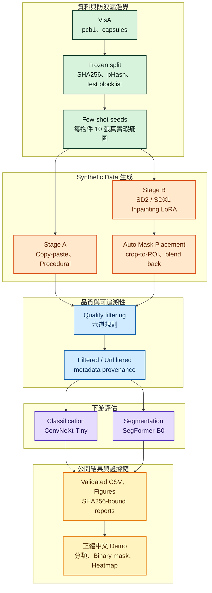

# DefectForge：VisA Synthetic Data 瑕疵生成與評估

[](LICENSE)
[](https://github.com/kuotunyu/defectforge-visa-synthetic-data/releases/latest)

本專案在每個物件僅有 **10 張真實瑕疵圖**的極度少樣本條件下，以 Open Model 與 Open Data 架構重建 NVIDIA GTC 2026 Cosmos AnomalyGen 工業瑕疵合成與下游評估方法論。

[Synthetic Dataset](https://huggingface.co/datasets/steven0226/defectforge-visa-synthetic) ·
[SD2 / SDXL LoRA Weights](https://huggingface.co/steven0226/defectforge-visa-lora) ·
[正體中文 Demo](https://steven0226-defectforge-visa-demo.hf.space/) ·
[Release 頁面](https://github.com/kuotunyu/defectforge-visa-synthetic-data/releases)

---

## 關鍵摘要

**主要結論：在極度少樣本資料規模下，合成資料未改善下游任務——此陰性結論經過了四次獨立預註冊檢驗。**

- **下游任務比較**：在 Classification 與 Segmentation 任務上，經過多重篩選的 Synthetic Data 未展現優於 Real-only 基準之表現。
- **機制預註冊 Gate**：為排除方法調用疑慮，發起四次預註冊 Pilot 檢驗曝光失衡、瑕疵外觀與放置面積三個機制，四次 Gate 全數未通過，確保 Frozen Test 從未被提前讀取。
- **多 Seed 複跑統計**：將分割實驗補充至 3 個 Seed 複跑後，推翻了單一 Seed (seed 42) 的局部正向訊號，使陰性結論具備高度統計穩健性。
- **可重現性驗證**：同一批模型於不同機器執行時達成 SHA256 逐 Byte 相同之 Bit-level 可重現性。

---

## 研究問題

Synthetic Data 能否改善少樣本工業瑕疵的 Classification 與 Segmentation 表現？

| 評測項目 | 實驗設定規範 |
|---|---|
| **資料集** | [VisA](https://registry.opendata.aws/visa/)（CC BY 4.0）：`pcb1`、`capsules` |
| **真實瑕疵預算** | 每個物件僅允許 10 張真實瑕疵圖 (Seed 42) |
| **下游評估任務** | Defect Classification 與 Defect-region Segmentation |
| **Synthetic Data 標註** | 全自動產生；放置 Mask 即為 Segmentation Ground Truth |

### 避免資料切分洩漏 (Split Leakage)

VisA 官方 `2cls_fewshot` 與 `2cls_highshot` CSV 係同一批影像的兩種切分方式。本專案於開發前進行交集測試：

```text
highshot TRAIN(anomaly) ∩ fewshot TEST(anomaly) = 40 (每個物件，Test 共 80 張)
fewshot TRAIN ⊂ highshot TRAIN                         True
highshot TEST ⊂ fewshot TEST                           True
```

若混用兩套切分將導致 50% 的 Test 瑕疵影像滲透至 Training 集中。因此本專案統一採用 `2cls_highshot` 作為 Base Partition，共享不可動搖之 Frozen Test Set (詳見 [ADR-007](docs/decisions.md#adr-007))。

---

## 系統架構與 Pipeline



整體管線包含 Frozen Split 與 Test Blocklist、Copy-paste / Procedural / Diffusion 混合生成、六道 Quality Filtering 護欄、ConvNeXt-Tiny 分類器、SegFormer-B0 分割器與 SHA256-bound 可追溯證據鏈 (詳見 [方法論文件](docs/methodology.md))。

### Agent 工作流規範

本專案提供專案層級之 Agent Skill 控制層：

| Agent Skill | 職責與權限範圍 |
|---|---|
| [`defectforge`](.claude/skills/defectforge/SKILL.md) | Orchestrator：脈絡恢復、階段路由與里程碑收尾 |
| [`df-guard`](.claude/skills/df-guard/SKILL.md) | 防洩漏護欄：Frozen Manifest Checksum、Test Blocklist 比對與身分邊界 |

---

## 實驗設計

主實驗包含五組控制組；第 1–4 組採用完全相同之真實資料，Synthetic Data 僅採純增量方式加入，全數於相同 Frozen Test Set 上進行評估：

1. **Real-only**：10 張真實瑕疵圖
2. **+ Standard Augmentation**：驗證傳統增強效果
3. **+ 未篩選 Synthetic Data**
4. **+ 已篩選 Synthetic Data**：主要比較組
5. **Full-real Upper Bound**：60 張真實瑕疵圖

Validation 與 Test 僅使用真實資料，生成器與過濾器絕不存取 Test 影像 (詳見 [實驗設計文件](docs/experiment_protocol.md))。

---

## 實驗結果

結果表格由 `scripts/verify_readme.py --write` 自動產生並通過獨立驗證器核對。


### 瑕疵分類 (Classification)

<!-- BEGIN VERIFIED CLASSIFICATION_MAIN -->
| 物件 | 訓練組別 | Macro-F1 | 瑕疵 F1 | AUROC | 正常樣本 FPR |
| --- | --- | --- | --- | --- | --- |
| pcb1 | Real-only（10 張） | 0.6826 | 0.4815 | 0.9086 | 0.2065 |
| pcb1 | + Standard Augmentation | 0.6826 | 0.4815 | 0.9157 | 0.2065 |
| pcb1 | + 未篩選 Synthetic Data | 0.4866 | 0.1858 | 0.5556 | 0.3134 |
| pcb1 | + 已篩選 Synthetic Data | 0.4270 | 0.0160 | 0.2229 | 0.2090 |
| pcb1 | Full-real（60 張） | 0.6826 | 0.4815 | 0.9294 | 0.2065 |
| capsules | Real-only（10 張） | 0.5728 | 0.2535 | 0.7934 | 0.0913 |
| capsules | + Standard Augmentation | 0.6031 | 0.3333 | 0.7656 | 0.1452 |
| capsules | + 未篩選 Synthetic Data | 0.3839 | 0.0331 | 0.3145 | 0.3278 |
| capsules | + 已篩選 Synthetic Data | 0.3712 | 0.0444 | 0.2844 | 0.3817 |
| capsules | Full-real（60 張） | 0.6748 | 0.4874 | 0.8583 | 0.2075 |
<!-- END VERIFIED CLASSIFICATION_MAIN -->


#### 預註冊 3-seed 複跑 (Mean ± Std)

<!-- BEGIN VERIFIED CLASSIFICATION_SEED_VARIANCE -->
| 物件 | 訓練組別 | Seeds | Macro-F1（mean ± std） | AUROC（mean ± std） |
| --- | --- | --- | --- | --- |
| pcb1 | Real-only（10 張） | 3 | 0.6808 ± 0.0031 | 0.9265 ± 0.0231 |
| pcb1 | + 已篩選 Synthetic Data | 3 | 0.3175 ± 0.1066 | 0.1677 ± 0.0502 |
| capsules | Real-only（10 張） | 3 | 0.5471 ± 0.0268 | 0.8160 ± 0.0224 |
| capsules | + 已篩選 Synthetic Data | 3 | 0.3609 ± 0.0201 | 0.3243 ± 0.0426 |
<!-- END VERIFIED CLASSIFICATION_SEED_VARIANCE -->

### 瑕疵區域分割 (Segmentation)

<!-- BEGIN VERIFIED SEGMENTATION_MAIN -->
| 物件 | 訓練組別 | Dice | mIoU | Pixel AUROC | AUPRO |
| --- | --- | --- | --- | --- | --- |
| pcb1 | Real-only（10 張） | 0.3762 | 0.6156 | 0.9460 | 0.6028 |
| pcb1 | + Standard Augmentation | 0.3836 | 0.6185 | 0.9144 | 0.5740 |
| pcb1 | + 未篩選 Synthetic Data | 0.2490 | 0.5709 | 0.9324 | 0.6065 |
| pcb1 | + 已篩選 Synthetic Data | 0.0621 | 0.5156 | 0.9010 | 0.7471 |
| pcb1 | Full-real（60 張） | 0.6862 | 0.7610 | 0.9296 | 0.5999 |
| pcb1 | 僅 Procedural | 0.0316 | 0.5076 | 0.8551 | 0.5963 |
| pcb1 | 僅 Copy-paste | 0.0000 | 0.4997 | 0.9015 | 0.4386 |
| pcb1 | 僅 Diffusion | 0.0000 | 0.4997 | 0.8288 | 0.4556 |
| pcb1 | All-mixed（與已篩選 Synthetic Data 共用） | 0.0621 | 0.5156 | 0.9010 | 0.7471 |
| capsules | Real-only（10 張） | 0.5958 | 0.7119 | 0.9858 | 0.8488 |
| capsules | + Standard Augmentation | 0.0000 | 0.4996 | 0.8661 | 0.5591 |
| capsules | + 未篩選 Synthetic Data | 0.0000 | 0.4996 | 0.4919 | 0.1666 |
| capsules | + 已篩選 Synthetic Data | 0.4570 | 0.6477 | 0.9737 | 0.9137 |
| capsules | Full-real（60 張） | 0.6331 | 0.7312 | 0.9991 | 0.9591 |
| capsules | 僅 Procedural | 0.0000 | 0.4996 | 0.6127 | 0.3506 |
| capsules | 僅 Copy-paste | 0.6101 | 0.7191 | 0.9869 | 0.9440 |
| capsules | 僅 Diffusion | 0.0000 | 0.4996 | 0.5178 | 0.2556 |
| capsules | All-mixed（與已篩選 Synthetic Data 共用） | 0.4570 | 0.6477 | 0.9737 | 0.9137 |
<!-- END VERIFIED SEGMENTATION_MAIN -->


#### 預註冊 3-seed 複跑 (Mean ± Std)

<!-- BEGIN VERIFIED SEGMENTATION_SEED_VARIANCE -->
| 物件 | 訓練組別 | Seeds | Dice（mean ± std） | AUPRO（mean ± std） |
| --- | --- | --- | --- | --- |
| pcb1 | Real-only（10 張） | 3 | 0.3300 ± 0.0489 | 0.5834 ± 0.0168 |
| pcb1 | + Standard Augmentation | 3 | 0.4103 ± 0.0789 | 0.6067 ± 0.0308 |
| pcb1 | + 未篩選 Synthetic Data | 3 | 0.0830 ± 0.1438 | 0.5783 ± 0.0508 |
| pcb1 | + 已篩選 Synthetic Data | 3 | 0.0438 ± 0.0381 | 0.6600 ± 0.0993 |
| pcb1 | Full-real（60 張） | 3 | 0.6754 ± 0.0193 | 0.7022 ± 0.1439 |
| pcb1 | 僅 Procedural | 3 | 0.1543 ± 0.1190 | 0.5790 ± 0.0462 |
| pcb1 | 僅 Copy-paste | 3 | 0.0000 ± 0.0000 | 0.4906 ± 0.0550 |
| pcb1 | 僅 Diffusion | 3 | 0.0000 ± 0.0000 | 0.4711 ± 0.0829 |
| pcb1 | All-mixed（與已篩選 Synthetic Data 共用） | 3 | 0.0438 ± 0.0381 | 0.6600 ± 0.0993 |
| capsules | Real-only（10 張） | 3 | 0.5253 ± 0.0693 | 0.7965 ± 0.0520 |
| capsules | + Standard Augmentation | 3 | 0.1404 ± 0.2432 | 0.6509 ± 0.1413 |
| capsules | + 未篩選 Synthetic Data | 3 | 0.0000 ± 0.0000 | 0.2405 ± 0.1169 |
| capsules | + 已篩選 Synthetic Data | 3 | 0.1523 ± 0.2639 | 0.4751 ± 0.3834 |
| capsules | Full-real（60 張） | 3 | 0.6722 ± 0.0389 | 0.9417 ± 0.0252 |
| capsules | 僅 Procedural | 3 | 0.0000 ± 0.0000 | 0.2685 ± 0.1015 |
| capsules | 僅 Copy-paste | 3 | 0.3895 ± 0.3383 | 0.9124 ± 0.0463 |
| capsules | 僅 Diffusion | 3 | 0.0000 ± 0.0000 | 0.2569 ± 0.0358 |
| capsules | All-mixed（與已篩選 Synthetic Data 共用） | 3 | 0.1523 ± 0.2639 | 0.4751 ± 0.3834 |
<!-- END VERIFIED SEGMENTATION_SEED_VARIANCE -->

#### 跨機器重現性驗證

<!-- BEGIN VERIFIED SEGMENTATION_REPRODUCTION -->
- 重新執行 seed 42 的實跑 run：**16** 個（2 個物件 × 8 組）。
- `model.safetensors` SHA256 與已發佈值相同者：**16 / 16**。判定：**逐 bit 相同**。
- 四項指標的最大絕對差：dice `0.00000000`、miou `0.00000000`、pixel_auroc `0.00000000`、aupro `0.00000000`。
- 基準是複跑前已發佈的表格 `reports/segmentation_seed42_baseline.csv`；比對由 `scripts/verify_seed42_reproduction.py` 執行，逐 run 結果見[重現檢查報告](reports/seed42_reproduction.md)。
<!-- END VERIFIED SEGMENTATION_REPRODUCTION -->

#### Dice 與 AUPRO 門檻敏感度分析

<!-- BEGIN VERIFIED SEGMENTATION_THRESHOLD -->
| 物件 | 訓練組別 | Dice（threshold 0.5） | AUPRO（不依賴 threshold） | Dice Δ vs Real-only | AUPRO Δ vs Real-only |
| --- | --- | --- | --- | --- | --- |
| pcb1 | Real-only（10 張） | 0.3762 | 0.6028 | — | — |
| pcb1 | + Standard Augmentation | 0.3836 | 0.5740 | +0.0074 | -0.0288 |
| pcb1 | + 未篩選 Synthetic Data | 0.2490 | 0.6065 | -0.1272 | +0.0037 |
| pcb1 | + 已篩選 Synthetic Data | 0.0621 | 0.7471 | -0.3140 | +0.1443 |
| pcb1 | Full-real（60 張） | 0.6862 | 0.5999 | +0.3100 | -0.0029 |
| capsules | Real-only（10 張） | 0.5958 | 0.8488 | — | — |
| capsules | + Standard Augmentation | 0.0000 | 0.5591 | -0.5958 | -0.2897 |
| capsules | + 未篩選 Synthetic Data | 0.0000 | 0.1666 | -0.5958 | -0.6821 |
| capsules | + 已篩選 Synthetic Data | 0.4570 | 0.9137 | -0.1387 | +0.0649 |
| capsules | Full-real（60 張） | 0.6331 | 0.9591 | +0.0373 | +0.1103 |
<!-- END VERIFIED SEGMENTATION_THRESHOLD -->

<!-- BEGIN VERIFIED SEGMENTATION_REPLICATION -->
| 物件 | Dice／AUPRO 符號相反的 seed | Dice Δ（mean ± std） | AUPRO Δ（mean ± std） | 達預註冊門檻 |
| --- | --- | --- | --- | --- |
| pcb1 | 42, 44 | -0.2862 ± 0.0250 | +0.0766 ± 0.0878 | 是 |
| capsules | 42 | -0.3730 ± 0.2055 | -0.3215 ± 0.3357 | 否 |

- 規則 1（方向矛盾）判定：**真實現象**。門檻是「至少一個物件上、3 個 seed 中 ≥2 個符號相反」，達標物件：pcb1。
- 規則 2（`capsules/std_aug` 崩潰）判定：**系統性**。Dice 為零的 seed：42、44。因此 ADR-031 的主張維持不變。
- 兩條規則都在 [ADR-032](docs/decisions.md#adr-032) 於**複跑執行前**寫死，看到結果後未作任何修改。
<!-- END VERIFIED SEGMENTATION_REPLICATION -->

---

## Sampling 影響之驗證實驗

在完全不存取 Test Set 前提下，v2 Pilot 檢驗 Label Balancing 是否導致 Synthetic Anomaly 過度占用正樣本曝光：

| Validation 候選方案 | pcb1 Macro-F1 | pcb1 AUROC | capsules Macro-F1 | capsules AUROC |
|---|---:|---:|---:|---:|
| **Real-only** | 0.6944 | 0.9167 | 0.8133 | 0.9120 |
| **v1 Class-balanced Mixing** | 0.5537 | 0.3139 | 0.4545 | 0.2083 |
| **Domain-balanced 50% Real Bad** | 0.6944 | **0.9389** | 0.6571 | 0.7500 |
| **Domain-balanced 75% Real Bad** | 0.6944 | 0.8806 | 0.6571 | **0.8611** |

---

## 曝光、外觀與面積機制檢驗

v2 之後進行之三次 Pilot 均於執行前將判定規則 Commit 至 Git：

| Pilot 階段 | 檢驗之機制假說 | 判定結果 | 預註冊依據 |
|---|---|---|---|
| **v2** | 合成樣本淹沒真實瑕疵之**曝光**失衡 | Gate 未過；部分改善 | [ADR-026](docs/decisions.md#adr-026) |
| **v3** | 效能落差來自**外觀**或放置位移 | 依物件而異；主物件無鑑別力 | [ADR-035](docs/decisions.md#adr-035) |
| **v4** | 限制放置**面積**符合真實分佈 | 未能檢驗 (主指標無鑑別力) | [ADR-038](docs/decisions.md#adr-038) |
| **v5** | 同 v4，複跑至 3 Seeds | **無效果** (有效陰性結論) | [ADR-040](docs/decisions.md#adr-040) |

---

## 程序化合成特徵洩漏檢驗

「僅 Procedural」組未存取真實瑕疵像素，惟其 Mask 面積與長寬比被限制於 10 張 Few-shot 訓練 Mask 之 5–95 百分位內：

<!-- BEGIN VERIFIED CLASSIFICATION_LEAKAGE_SURFACE -->
| 物件 | Macro-F1（用統計量） | Macro-F1（不用） | Δ | AUROC（用統計量） | AUROC（不用） | Δ |
| --- | --- | --- | --- | --- | --- | --- |
| pcb1 | 0.5417 | 0.5994 | -0.0577 | 0.7272 | 0.8091 | -0.0820 |
| capsules | 0.4723 | 0.4848 | -0.0125 | 0.5000 | 0.5119 | -0.0119 |
<!-- END VERIFIED CLASSIFICATION_LEAKAGE_SURFACE -->

使用統計量之版本反而表現較差，證明此洩漏層面並未帶來人為性能抬升。

---

## 成果展示


[線上開啟正體中文 DefectForge Demo](https://steven0226-defectforge-visa-demo.hf.space/)

Demo 執行於 CPU 基礎環境，輸出包含 Classification Confidence、Binary Mask、Probability Heatmap 與 Checkpoint Provenance。

---

## 限制與誠實揭露

<!-- BEGIN VERIFIED RESULT_OUTCOME -->
- Classification：已篩選 Synthetic Data 相對 Real-only 的平均 Macro-F1 差異為 `-0.2286`。
- Segmentation：已篩選 Synthetic Data 相對 Real-only 的平均 Dice 差異為 `-0.2264`（seed 42 錨點）。
- Classification 負面結果：**是——已篩選 Synthetic Data 未提升平均 Macro-F1。**
- Segmentation 負面結果：**是——已篩選 Synthetic Data 未提升平均 Dice。**
- Segmentation（threshold-free）：seed 42 的平均 AUPRO 差異為 `+0.1046`，與 Dice **方向相反**。
- **複跑後這個 AUPRO 提升沒有重現。**3 個 seed（42, 43, 44）的兩物件平均：Dice `-0.3296 ± 0.0903`、AUPRO `-0.1224 ± 0.1976`，兩者方向一致。seed 42 單獨呈現的 AUPRO 正向差異是該 seed 的特例。
- 依 ADR-032 **執行前寫死**的規則判定：Dice／AUPRO 方向矛盾為**真實現象**（達標物件：pcb1）；`capsules/std_aug` 的 Dice 崩潰為**系統性**。
- 48 個實跑的 Segmentation run 中有 23 個在固定 threshold 0.5 下 Dice = 0（整張預測為背景），其中 12 個的 pixel AUROC 仍達 0.80 以上（最高 `0.9066`）。
- 主結論仍以預註冊的 Macro-F1 與 Dice 為準；AUPRO 與 threshold 敏感度是**併列揭露**，不是事後換指標。
<!-- END VERIFIED RESULT_OUTCOME -->

---

## 快速開始

需求：Windows 11、Python 3.12、NVIDIA RTX 4090 GPU、`uv`。

```powershell
# 1. 複製專案與初始化環境
git clone https://github.com/kuotunyu/defectforge-visa-synthetic-data.git
Set-Location defectforge-visa-synthetic-data
uv sync --frozen --python 3.12

# 2. 資料下載與 Split 驗證
uv run python scripts/download_visa.py
uv run python scripts/prepare_splits.py
uv run python scripts/verify_splits.py

# 3. 執行測試與發布驗證
uv run ruff check .
uv run pytest -q
uv run python scripts/verify_publish.py
```

---

## 專案結構

| 目錄路徑 | 內容規範 |
|---|---|
| `src/` | Data、Synthetic、Filtering、Training 與 Inference 核心原始碼 |
| `configs/`、`splits/` | 可重現設定檔、Frozen Manifest 與 Test Blocklist |
| `scripts/`、`tests/` | 自動化執行腳本、獨立 Validator 與單元測試 |
| `docs/` | 方法論、Experiment Protocol、CLI 契約與 ADR 決策文件 |
| `reports/`、`results/` | SHA256-bound 證據鏈、圖表與凍結數據 |
| `.claude/skills/` | 公開 Agent Skill：Orchestrator 與防洩漏 Guard |

---

## 授權與引用

本 Repository 之程式碼採用 **MIT License** ([LICENSE](LICENSE))。原始資料集與模型權重保留各自上游條款：

<!-- BEGIN VERIFIED LICENSE_CHAIN -->
| 資產 | License | DefectForge 義務 |
|---|---|---|
| VisA 原始 Dataset | CC BY 4.0 | 標示 VisA 與其論文；Hugging Face Dataset 不得包含原始影像 |
| `sd2-community/stable-diffusion-2-inpainting` | CreativeML Open RAIL++-M | 保留用途限制，並揭露 preservation mirror |
| `diffusers/stable-diffusion-xl-1.0-inpainting-0.1` | CreativeML Open RAIL++-M | 保留用途限制 |
| `facebook/dinov2-base` | Apache-2.0 | 標示模型與 DINOv2 論文 |
| DefectForge Synthetic Images | CC BY 4.0 | 視為 VisA 衍生內容；保留 VisA attribution，並揭露 Diffusion base model License |
| DefectForge LoRA Weights | CreativeML Open RAIL++-M | 繼承對應 base model 的限制，並附上 License 連結 |
| DefectForge Source Code | MIT | MIT 僅授權程式碼，不包含 Dataset 與 Model Weights |
<!-- END VERIFIED LICENSE_CHAIN -->

如需引用本專案，請參考 [`CITATION.cff`](CITATION.cff)。詳細上游授權鏈見 [License Chain](docs/license_chain.md)。
