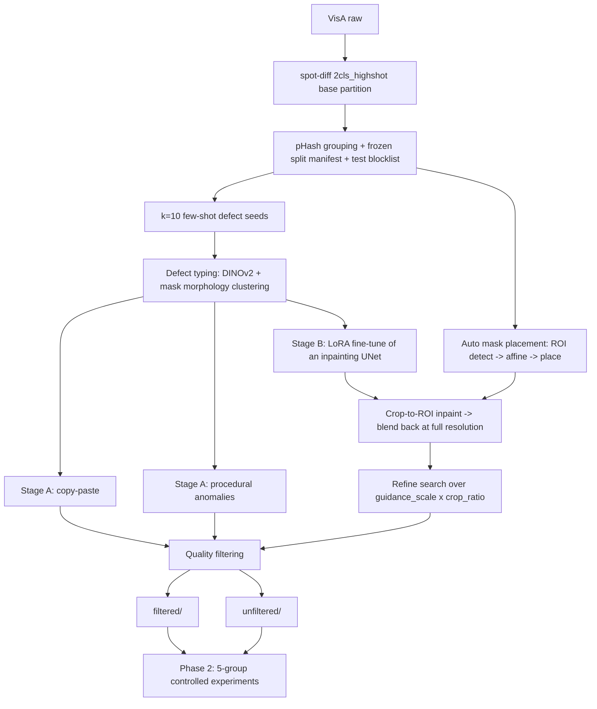

# DefectForge-VisA

> **Status: Phase 1 in progress — no results yet.** This README is a skeleton; every
> section marked `TBD` is filled from raw artefacts under `results/` at the end of Phase 2.
> Numbers must never be typed by hand — see `scripts/verify_readme.py` (Phase 2).

**Can synthetic defect images improve few-shot industrial anomaly classification and
segmentation?** An open-source replication of the NVIDIA GTC 2026 course
*Few-shot Industrial Synthetic Data Generation with the NVIDIA Defect Image Generation Agent*
(Cosmos AnomalyGen), rebuilt entirely with open models and open data.

**繁中摘要**：在「每個物件只有 10 張真實瑕疵圖」的少樣本情境下，用兩階段合成資料
（程序化／copy-paste ＋ diffusion inpainting LoRA）證明合成資料能否提升瑕疵分類與瑕疵區域分割。
方法論復刻 NVIDIA GTC 2026 的 Cosmos AnomalyGen 課程，但全部改用開源工具實作。
若合成資料**沒有**帶來提升，我們會如實報告並分析原因。

---

## Problem

Real production lines rarely have enough defect images to train a reliable AOI model.
On VisA, each object ships only **100 anomalous images**, and the official few-shot
protocol trims that to **10**. Meanwhile normal images are essentially free.
This is exactly the asymmetry synthetic data should be able to close.

| | |
|---|---|
| Dataset | [VisA](https://registry.opendata.aws/visa/) (CC BY 4.0) — `pcb1`, `capsules` |
| Real defect budget | 10 images per object (seed=42) |
| Downstream tasks | defect classification + defect-region segmentation |
| Labels for synthetic data | **fully automatic** — the placed mask *is* the segmentation ground truth |

### The split matters, and it is easy to get wrong

VisA's official `2cls_fewshot` and `2cls_highshot` CSVs are two different partitions of the
same images. We measured their overlap before writing any code:

```
highshot TRAIN(anomaly) ∩ fewshot TEST(anomaly) = 40   (per object, out of 80)
fewshot TRAIN ⊂ highshot TRAIN                          True
highshot TEST ⊂ fewshot TEST                            True
```

Training a "full-real upper bound" on the highshot train split and scoring it on the fewshot
test split would put **half the test defects into training**. We therefore use
`2cls_highshot` as the single base partition, giving one frozen test set shared by every
group. Because the partitions nest, this also hands us a free real-data scaling curve at
**10 → 20 → 60** real defect images — which is what lets us answer *how many real defect
images our synthetic data is worth*. Details: [ADR-007](docs/decisions.md#adr-007).

## Method



The mapping from each Cosmos AnomalyGen component to its open-source stand-in is
documented cell-by-cell in [docs/methodology.md](docs/methodology.md), including which
parts are our own interpretation rather than published NVIDIA formulas.

## Experiments

Five groups, identical real data in groups 1–4, synthetic strictly additive, all scored on
the same frozen test set:

1. Real-only (10 real defects)
2. + Standard Augmentation — rules out "plain augmentation would have done it"
3. + Unfiltered Synthetic
4. + Filtered Synthetic — main result, and the case for the filtering pipeline
5. Full-real upper bound (60 real defects)

Plus: a real-data scaling curve (10 / 20 / 60), a synthetic-volume sweep at
{125, 250, 500} mirroring the course's own curve, a base-model ablation (SD2 vs SDXL),
and a segmentation group trained with **zero real defect pixels**.

Anti-leakage: validation and test are real-only; the generator, the filter and the
defect-type clusterer never read a test image. The split manifest (seed, SHA256,
pHash groups) is frozen before a single synthetic image is generated, and
`splits/test_blocklist.json` is published so anyone can check us.
Full protocol: [docs/experiment_protocol.md](docs/experiment_protocol.md).

## Results

TBD — Phase 2.

## Reproduce

TBD — filled in at the end of Phase 1 (environment) and Phase 2 (experiments).
See [docs/environment.md](docs/environment.md) for the current setup notes.

## Repository map

| Path | What it holds |
|---|---|
| [CLAUDE.md](CLAUDE.md) | Working rules for this repo |
| [PLAN.md](PLAN.md) | Phase 1 milestones with per-item verification |
| [docs/](docs/) | Methodology, protocols, specs, ADRs, worklog |
| `src/` | Pipeline code (data / synthetic / filtering / training / evaluation / inference) |
| `splits/` | Frozen split manifest, checksums, defect taxonomy |
| `notebooks/` | Colab notebooks (LoRA training) |
| `reports/` | Generated reports and figures |
| `.claude/skills/` | Project-level agent skills mirroring the course's agentic flow |

## License & Citations

Source code in this repository: **MIT** (see [LICENSE](LICENSE)). The MIT grant covers
code only — data and model weights carry their own terms:

| Asset | License | Note |
|---|---|---|
| VisA dataset | CC BY 4.0 | Attribution required; redistribution of derivatives permitted |
| `sd2-community/stable-diffusion-2-inpainting` | CreativeML Open RAIL++-M | Immutable preservation mirror of the unavailable original; see ADR-014 |
| `diffusers/stable-diffusion-xl-1.0-inpainting-0.1` | CreativeML Open RAIL++-M | Same |
| `facebook/dinov2-base` | Apache-2.0 | Used for filtering and defect typing |
| Synthetic images produced here | TBD — declared on the HF dataset card in Phase 2 | Derived from VisA, so CC BY 4.0 attribution carries through |

References:

- Zou et al., *SPot-the-Difference Self-Supervised Pre-training for Anomaly Detection
  and Segmentation* (ECCV 2022) — the VisA dataset and its official splits.
  [arXiv:2207.14315](https://arxiv.org/abs/2207.14315) ·
  [amazon-science/spot-diff](https://github.com/amazon-science/spot-diff)
- Hu et al., *AnomalyDiffusion: Few-Shot Anomaly Image Generation with Diffusion Model*
  (AAAI 2024) — the spatial-anomaly-embedding idea this pipeline mirrors.
  [arXiv:2312.05767](https://arxiv.org/abs/2312.05767)
- Zavrtanik et al., *DRAEM* (ICCV 2021) — procedural anomaly synthesis.
- Ghiasi et al., *Simple Copy-Paste is a Strong Data Augmentation Method* (CVPR 2021).
- NVIDIA GTC Taiwan 2026, *Few-shot Industrial Synthetic Data Gen with NVIDIA Defect
  Image Generation Agent* — methodological inspiration. This repository is an
  independent open-source replication and is **not** affiliated with or endorsed by NVIDIA.
