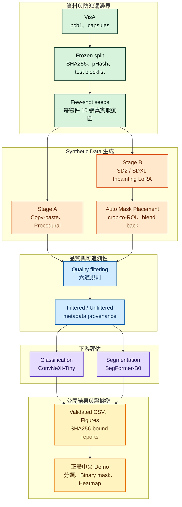

# 重現步驟、專案結構與完整架構圖

> 這份文件收錄從 [README](../README.md) 移出的重現細節。環境安裝見 [environment.md](environment.md)，各腳本的 CLI 參數見 [interfaces.md](interfaces.md)，常見錯誤見 [troubleshooting.md](troubleshooting.md)。

## 完整重現步驟

需求：Windows 11、Python 3.12、NVIDIA RTX 4090 GPU、`uv`。

```powershell
# 1. 複製專案與初始化環境
git clone https://github.com/kuotunyu/defectforge-visa-synthetic-data.git
Set-Location defectforge-visa-synthetic-data
uv sync --frozen --python 3.12

# 2. 資料下載與 Split 驗證
uv run python scripts/download_visa.py
uv run python scripts/prepare_splits.py
uv run python scripts/verify_splits.py

# 3. 執行測試與發布驗證
uv run ruff check .
uv run pytest -q
uv run python scripts/verify_publish.py
```

- 第 2 步：`download_visa.py` 下載並驗證 VisA 原始資料；`prepare_splits.py` 準備官方 few-shot／high-shot 切分並檢查其不變量；`verify_splits.py` 獨立重跑切分與測試影像封鎖清單的檢查（[ADR-007](decisions.md#adr-007)）。
- `scripts/verify_publish.py` 不帶參數時是發佈前的嚴格檢查，會要求上游模型授權的查核報告在 24 小時內；平常驗證請加 `--allow-stale-license-check`，CI 也是這樣執行（見 [`.github/workflows/verify.yml`](../.github/workflows/verify.yml)）。
- README 的結果表由 `uv run python scripts/verify_readme.py --write` 從 `results/*.csv` 重新產生；不加 `--write` 則只核對。改動 README 後，需依序重跑 `verify_readme.py` 與 `verify_license_chain.py`，更新兩份記錄 README SHA256 的檢查報告（[`reports/readme_validation.json`](../reports/readme_validation.json)、[`reports/license_chain_validation.json`](../reports/license_chain_validation.json)）。

## 專案結構

| 目錄路徑 | 內容規範 |
|---|---|
| `src/` | Data、Synthetic、Filtering、Training 與 Inference 核心原始碼 |
| `configs/`、`splits/` | 可重現設定檔、Frozen Manifest 與 Test Blocklist |
| `scripts/`、`tests/` | 自動化執行腳本、獨立 Validator 與單元測試 |
| `docs/` | 方法論、Experiment Protocol、CLI 契約與 ADR 決策文件 |
| `reports/`、`results/` | SHA256-bound 證據鏈、圖表與凍結數據 |
| `.claude/skills/` | 公開 Agent Skill：Orchestrator 與防洩漏 Guard |

## 完整系統架構圖



整體管線包含 Frozen Split 與 Test Blocklist、Copy-paste / Procedural / Diffusion 混合生成、六道 Quality Filtering 護欄、ConvNeXt-Tiny 分類器、SegFormer-B0 分割器與 SHA256-bound 可追溯證據鏈 （詳見[方法論文件](methodology.md)）。
